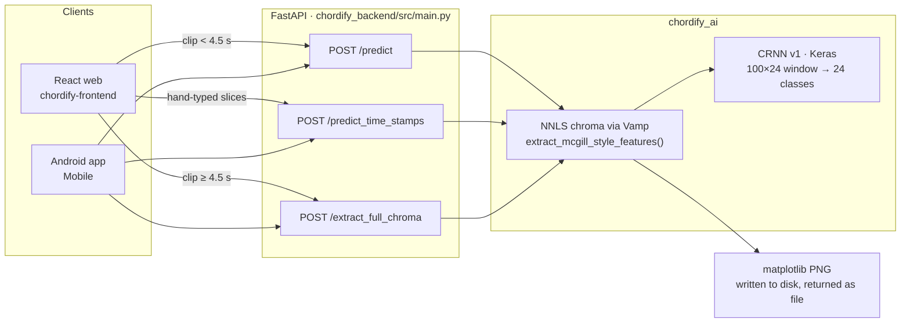

# 01 · Current state audit

> What Chordify does today, how the pieces talk to each other, and what has to change before we build progression recognition on top of it. Every finding links to the line of code or the measurement behind it.

## 1. What exists

| Part | Path | What it does |
|---|---|---|
| AI training | `chordify_ai/` | Downloads McGill Billboard from Kaggle, slices chroma features at annotated chord boundaries, trains a CNN + BiLSTM that classifies one 100 × 24 chroma window into one of **24 classes** (12 major + 12 minor). |
| Model artifact | `chordify_ai/assets/models/chord_crnn_model_v1.keras` | Keras 3.12, input `(None, 100, 24, 1)`, 3 conv blocks → BiLSTM(128) → Dense(256) → Dense(24) softmax. Reported val. accuracy ≈ 96.5 % (`assets/results_plotting/training_results.png`). |
| Backend | `chordify_backend/src/` | FastAPI app. Loads the Keras model at start-up, decodes uploads with librosa/pydub, extracts NNLS chroma through the Vamp plugin, and serves three endpoints. |
| Web | `chordify-frontend/` | React 19 + Vite. Records from the mic or accepts a file; short clips go to `/predict`, long clips go to `/extract_full_chroma` (returns a PNG), and the user can type time slices for `/predict_time_stamps`. |
| Android | `Mobile/` | Java app with Retrofit, Room history, record and chroma screens; same three endpoints. |

The system recognises **one chord per request**. "Long" audio is either turned into a chroma picture, or the user manually types start/end times and gets one chord per slice. Nothing finds chord boundaries automatically, nothing knows about keys, beats or sections, and nothing predicts what comes next.

## 2. How the v1 model was trained

```mermaid
flowchart LR
  K["Kaggle: jacobvs/mcgill-billboard<br/>bothchroma.csv + majmin.lab"] --> S["Slice chroma at every LAB line<br/>(one sample per line)"]
  S --> C["Drop N and X<br/>flat→sharp string map<br/>keep classes ≥ 500 samples"]
  C --> G["Divide by global max<br/>over the whole dataset"]
  G --> U["Undersample every class<br/>to the rarest class (807)"]
  U --> PAD["Zero-pad / centre-crop<br/>to 100 frames (4.64 s)"]
  PAD --> AUG["Append a noisy copy<br/>of every sample"]
  AUG --> SPLIT["Random 85/15 split<br/>(sample level)"]
  SPLIT --> T["Train CRNN, early stop on val loss"]
```

## 3. Findings

Severity: 🔴 blocks progression work or makes metrics untrustworthy · 🟠 hurts accuracy in production · 🟡 hygiene.

### 3.1 Model and data

| # | Sev. | Finding | Evidence |
|---|---|---|---|
| M1 | 🔴 | **The task is framed as single-window classification.** A 4.64 s window can hold one label, but real chords change every **1.61 s** (median) and **95.5 %** of chords are shorter than the window. The model cannot find boundaries, and there is no way to produce a timeline from it. | [`fig-chord-durations`](assets/fig-chord-durations-light.png), `crnn_model.py` (`return_sequences=False`) |
| M2 | 🔴 | **The reported 96.5 % accuracy is inflated by leakage.** The noisy copy of each sample is appended *before* the random split, so most test samples have a near-identical twin in training. Samples from the same song (and the 151 duplicate annotations of the same song) also land on both sides. | `dataset_logic.py:181`, `dataset_logic.py:205` |
| M3 | 🔴 | **Training windows are mostly zeros.** 99.9 % of LAB lines are shorter than 4.64 s, so on average only **32.8 %** of each 100-frame window holds signal and the rest is zero padding at the end. At inference the window is full of sound, a different distribution. | `dataset_logic.py:170`, `billboard_stats.json → current_samples` |
| M4 | 🔴 | **No "no chord" class.** `N` (silence, drums only, speech) is 4.8 % of song time and is dropped, so the model must call every silence a chord. Full-song recognition needs `N`. | `dataset_logic.py:111` |
| M5 | 🟠 | **Undersampling throws away 82 % of the data.** Every class is cut to the rarest class (G#:min, 807 samples): 19,368 of 109,896 samples survive. Transposition augmentation balances roots without discarding anything. | `dataset_logic.py:148–156`, [`fig-class-imbalance`](assets/fig-class-imbalance-light.png) |
| M6 | 🟠 | **Vocabulary is majors/minors only.** Plain triads are 61 % of annotated time; 7ths (dom7 8.9 %, min7 7.7 %, maj7 2.7 %) and slash chords (8.8 %) are folded or dropped. | [`fig-vocabulary`](assets/fig-vocabulary-light.png) |
| M7 | 🟡 | Enharmonics are mapped with a hand-written string table that misses spellings (e.g. `Gb:maj` is present but `E#`, `B#`, `Fb:min` are not). Pitch-class arithmetic removes the problem. | `dataset_logic.py:92` |

### 3.2 Train/serve skew (the model does not see at inference what it saw in training)

| # | Sev. | Finding | Evidence |
|---|---|---|---|
| S1 | 🔴 | **Frame rate mismatch (2×).** Billboard's `bothchroma` was computed at 44.1 kHz with a 2048-sample hop (46.4 ms/frame, so 100 frames = 4.64 s). The backend resamples uploads to **22,050 Hz** before calling the same plugin with the same hop, which gives 92.9 ms/frame, so the model's 100 frames now span **9.3 s**. The backend even plots with `sr=22050, hop_length=2048`. | `chordify_backend/src/config.py:11`, `utils.py:38,45,51`, `main.py:69` |
| S2 | 🔴 | **Normalisation mismatch.** Training divides everything by one global maximum over the whole dataset; inference divides each clip by its own maximum. Magnitudes differ between the two. | `dataset_logic.py:134` vs `chordify_ai/utils.py:54` |
| S3 | 🟠 | **Domain mismatch.** Billboard is full-band studio mixes with vocals and drums; the app's main input is one person strumming into a phone. No training data looks like that. | §02 datasets |
| S4 | 🟠 | Feature code lives in `chordify_ai/utils.py` and is imported by the backend through `sys.path` manipulation. Both packages have a `config.py` imported as `from config import *`, so which one wins depends on the working directory. | `main.py:14–18`, `chordify_ai/*.py` |

### 3.3 Backend and clients

| # | Sev. | Finding | Evidence |
|---|---|---|---|
| B1 | 🟠 | `predict_long_audio` calls `model.predict` **once per frame** in a Python loop (thousands of calls for a song) and averages everything into one label. | `inference.py:55–62` |
| B2 | 🟠 | Requests are synchronous; a full-song job would hold an HTTP connection open for its whole duration, with no progress, retry or cancellation. | `main.py` |
| B3 | 🟠 | `utils.py` imports `HTTPException` from `http.client`, which takes no keyword arguments. An unsupported file type raises a `TypeError` (HTTP 500) instead of HTTP 400. | `chordify_backend/src/utils.py:1` |
| B4 | 🟠 | `requirements.txt` is UTF-16 encoded and lists unrelated packages (Flask, pygame, nltk, wordcloud, pymongo…) while missing the real ones (tensorflow, librosa, vamp, pydub, python-multipart). A fresh install cannot run the backend. | `chordify_backend/requirements.txt` |
| B5 | 🟡 | Chroma PNGs are written to disk on every request and never deleted; the `.gitignore` entry points to a non-existent `chordify_backend/chordify_backend/...` path. | `main.py:69`, `.gitignore` |
| B6 | 🟡 | CORS `allow_origins=["*"]` together with `allow_credentials=True` is rejected by browsers for credentialed requests, and is too open for production. | `main.py:35–36` |
| B7 | 🟡 | The API base URL is hard-coded in both clients (`http://localhost:8000` in React, `http://192.168.1.37:8000/` in Android, cleartext). | `App.jsx:69,94,127`, `RetrofitClient.java:11` |
| B8 | 🟡 | No tests, no CI, no pinned model/label-map versioning: the label map is a pickle that is git-ignored, so the committed model cannot be served from a fresh clone. | `.gitignore` (`label_map.pkl`) |

## 4. What we keep

- **The NNLS "bothchroma" feature** (bass + treble chroma) for the first full-song model. It is the only way to keep using Billboard, whose audio is not distributable, and it is a strong, well-understood feature (it is what Chordino uses). The plan fixes how it is computed, not the feature itself.
- **McGill Billboard** as the backbone of chroma training *and* of the progression model (its annotations include keys, metre and sections; see [02](02-datasets.md)).
- **FastAPI, React + Vite and the Android app.** They are the right tools; they need an async job layer, a versioned API contract and a shared feature package, not a rewrite.
- The v1 endpoints stay alive behind an adapter until the mobile app moves to v2 ([05 §8](05-api-and-communication.md#8-backwards-compatibility-with-v1)).

## 5. Fix-first list (Phase 0 of the [roadmap](07-roadmap.md))

1. One shared `chordify_core.features` function used by training *and* serving, resampling to 44.1 kHz before NNLS chroma, with a golden-file test that compares its output to Billboard's `bothchroma.csv` frame rate and scale.
2. Song-level splits (deduplicated by title/artist), augmentation only inside the training split, N kept as a class.
3. Replace undersampling with 12-way transposition augmentation.
4. Real `requirements.txt`/`pyproject.toml`, `fastapi.HTTPException`, configurable base URLs, CORS allow-list.
5. An honest re-evaluation of v1 on held-out songs plus a small in-domain test set of phone recordings (see [02 §6](02-datasets.md#6-the-in-domain-test-set-we-must-record-ourselves)), so every later model is compared against a real baseline.
