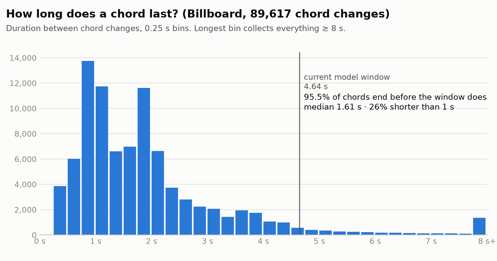
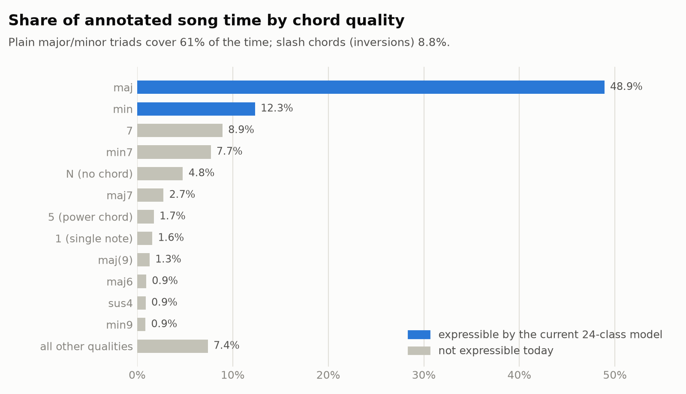
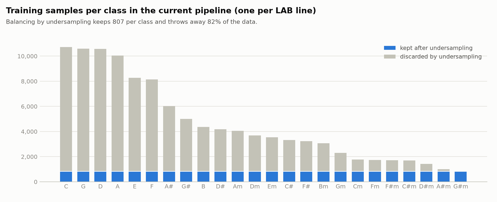
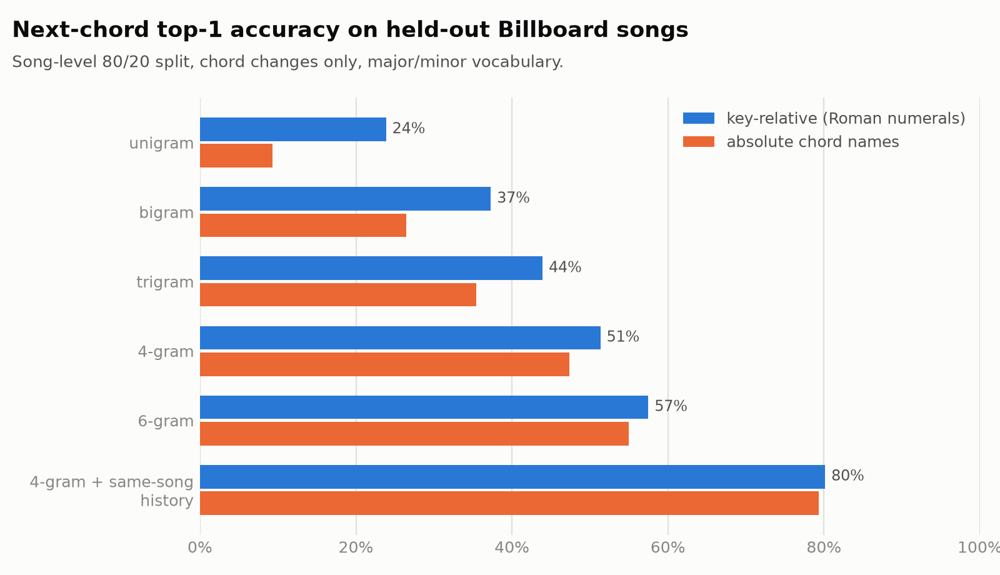
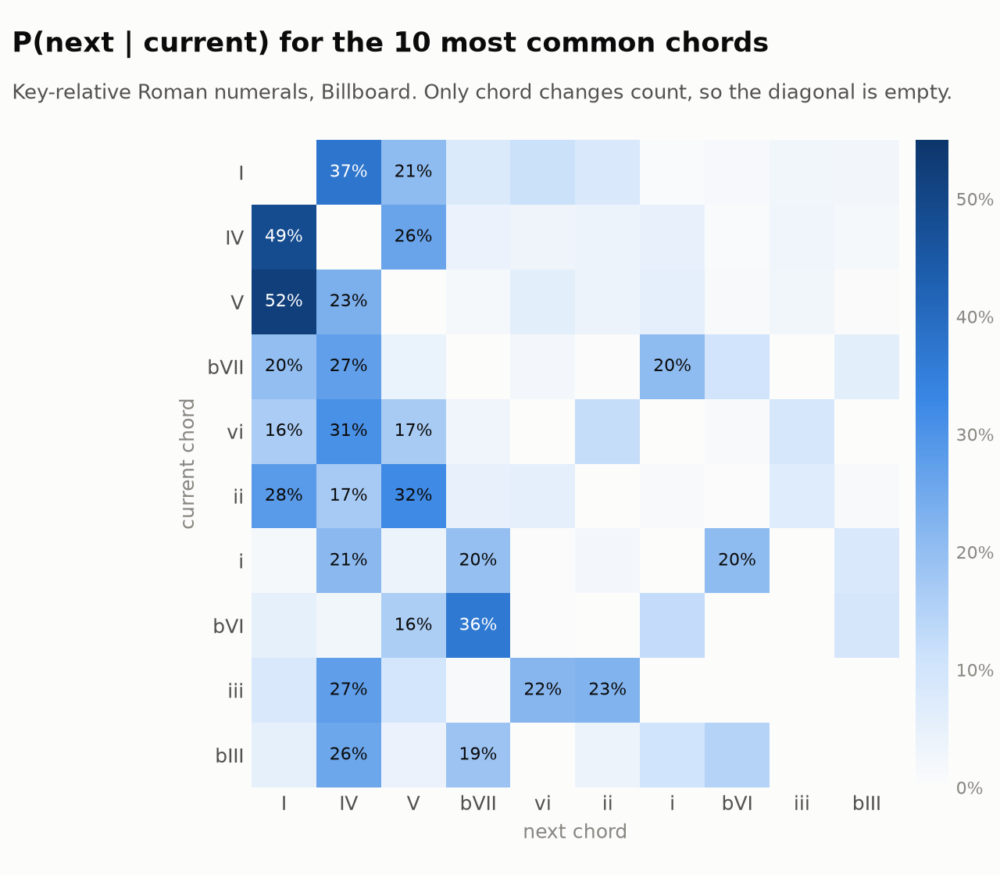
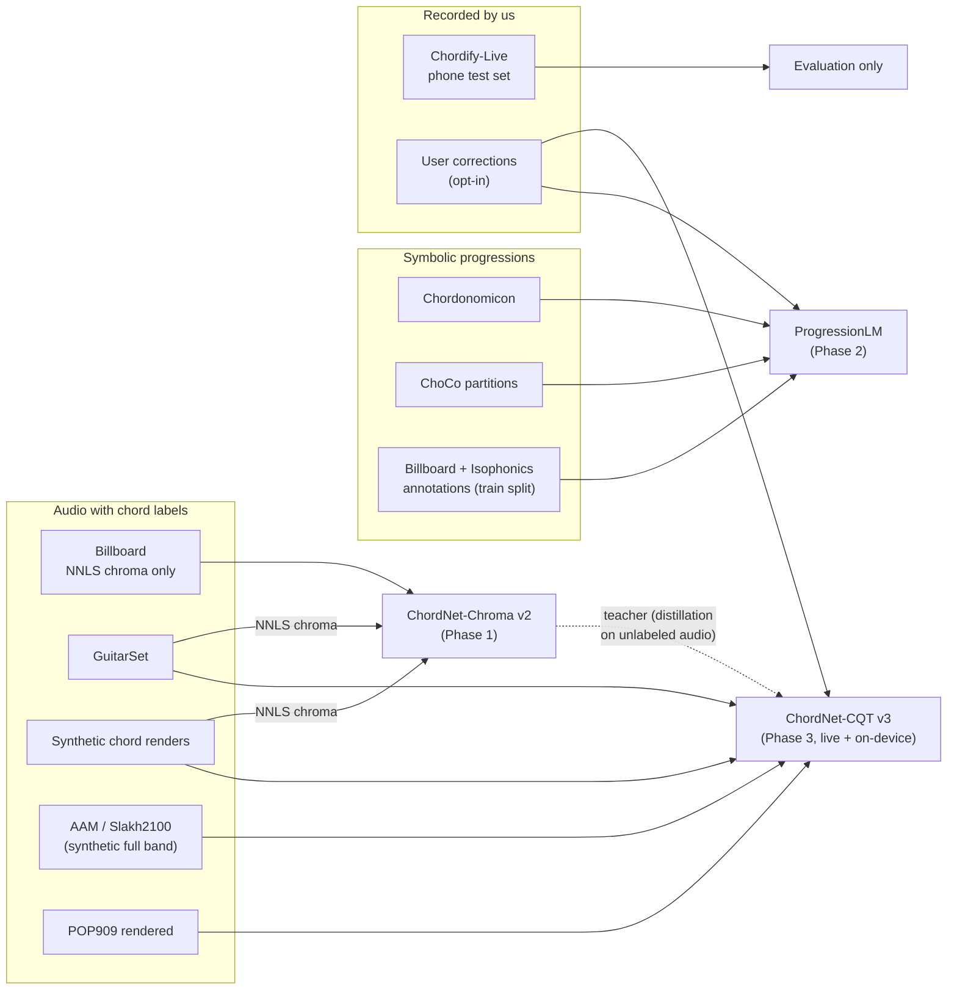
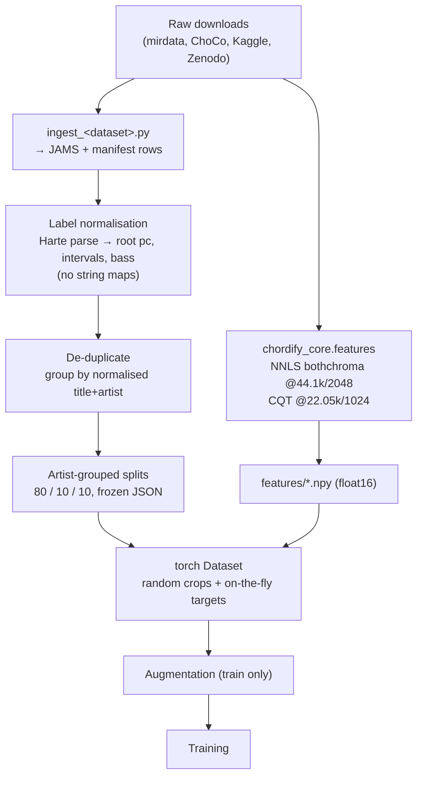
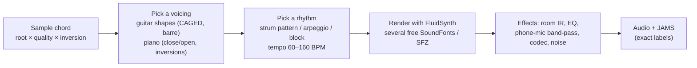

# 02 · Datasets

> Is McGill Billboard (the dataset v1 was trained on) good enough? What else do we need, for which model, and how do we turn all of it into one training pipeline?

All Billboard numbers below were computed from the 890 annotations by [`scripts/billboard_stats.py`](scripts/billboard_stats.py); the raw output is in [`assets/billboard_stats.json`](assets/billboard_stats.json).

## 1. Verdict

**Billboard stays, but it cannot carry the product alone.**

| Goal | Is Billboard enough? | Why |
|---|---|---|
| Full-song chord timeline (pop/rock) | **Yes, as the core** | 53.5 h of expert, time-aligned, full-band annotations. It is the standard benchmark for exactly this task. |
| Key / local key | **Mostly** | Tonic lines (including 82 modulating songs) are annotated; **mode is not**, so major/minor needs other data or inference from chords. |
| Beat-synchronous decoding | **Yes** | Bar and metre annotations give beat positions; 93 % of songs are 4/4. |
| Next-chord prediction | **Only as evaluation** | ~89 k chord changes is far too little to learn a general progression model; we need symbolic corpora with hundreds of thousands of songs. |
| Large vocabulary (7ths, sus, inversions) | **Partly** | The labels exist, but rare qualities have very few examples (e.g. `dim` is 0.19 % of time). |
| "Strum a chord into the phone" | **No** | Studio mixes with vocals and drums; zero solo-instrument, room-mic or phone recordings. |
| Moving beyond chroma, live/streaming, on-device | **No** | Audio is not distributed, only pre-computed NNLS chroma. Any model on another input (CQT, raw audio) needs other data. |

## 2. McGill Billboard in detail

| Property | Value |
|---|---|
| Content | Songs sampled from the US Billboard Hot 100, 1958–1991 (Burgoyne, Wild & Fujinaga, ISMIR 2011) |
| Annotations | **890** annotations of **739** unique songs (151 are repeat annotations of the same song, which must share a split), **53.5 h** |
| Labels | Harte chord syntax, available at several reductions (`full`, `majmin`, `majmin7`, `majmininv`, `majmin7inv`) plus `salami_chords.txt` with tonic, metre, bars and sections |
| Audio | **Not distributed.** Features only: NNLS "bothchroma" (12 bass + 12 treble bins, 44.1 kHz, hop 2048 = 46.4 ms), tuning, Echo Nest features |
| Access | Kaggle mirror `jacobvs/mcgill-billboard` (what v1 uses); the same annotations are also in [ChoCo](https://github.com/smashub/choco) as JAMS (what our scripts use, no Kaggle login needed) |

### 2.1 Chords are short, so the model must work frame by frame

<picture>
  <source media="(prefers-color-scheme: dark)" srcset="assets/fig-chord-durations-dark.png">
  
</picture>

- Median time between chord changes: **1.61 s** (p10 0.70 s, p90 3.66 s); **26 %** of chords last less than a second.
- A median song has **~26 chord changes per minute**.
- **24 %** of bars contain more than one chord, so decoding must work at beat level, not bar level.

Consequence: the new acoustic model outputs a label **for every frame** (46 ms) and a decoder turns frames into segments ([03 §3](03-models.md#3-decoding-from-frame-posteriors-to-a-chord-timeline)).

### 2.2 The vocabulary is richer than 24 classes

<picture>
  <source media="(prefers-color-scheme: dark)" srcset="assets/fig-vocabulary-dark.png">
  
</picture>

Under the standard MIREX `majmin` reduction, 88.0 % of time maps to a major/minor chord, 4.8 % is `N` and 7.3 % is `X` (sus, dim, aug, power chords…). We grow the vocabulary in tiers (§5.2) instead of jumping to 170 classes at once.

### 2.3 Imbalance is fixed by transposition, not by deleting data

<picture>
  <source media="(prefers-color-scheme: dark)" srcset="assets/fig-class-imbalance-dark.png">
  
</picture>

Major chords take 75 % of chord time and the most common class has 12.5× the time of the rarest. The imbalance is almost entirely about **roots** (songs are in guitar-friendly keys), and root imbalance disappears if every training example is also shown in all 12 transpositions: rolling both 12-bin chroma halves by *k* and shifting the labels by *k* is exact for chroma. What remains is **quality** imbalance (maj ≫ min ≫ 7ths), which we handle with loss weights (§5.4).

### 2.4 Keys, metre and structure come for free

- Tonic is annotated for every song; **82 songs (9.2 %) modulate**. Most common tonics: D (131), C (114), E (112), G (104), A (101).
- Metre: 4/4 in 831 songs, 12/8 in 32, 3/4 in 18, 6/8 in 11.
- Section labels: verse (2,480), chorus (2,424), intro (852), bridge (451), solo (434)… These let the progression model condition on "we are in the chorus".

### 2.5 Progressions are predictable, and even more so within a song

We tested simple next-chord predictors on held-out songs (song-level 80/20 split, 14,207 test transitions, chord changes only, maj/min vocabulary):

<picture>
  <source media="(prefers-color-scheme: dark)" srcset="assets/fig-next-chord-dark.png">
  
</picture>

| Predictor | Key-relative top-1 / top-3 | Absolute names top-1 / top-3 |
|---|---|---|
| Most common chord | 23.8 % / 58.7 % | 9.3 % / 26.6 % |
| Bigram (previous chord) | 37.3 % / 70.5 % | 26.5 % / 60.4 % |
| Trigram | 43.9 % / 77.4 % | 35.4 % / 72.5 % |
| 4-gram | 51.3 % / 80.2 % | 47.3 % / 74.9 % |
| 6-gram | 57.5 % / 78.3 % | 55.0 % / 73.5 % |
| **4-gram + the same song's earlier chords** | **80.1 % / 93.3 %** | 79.3 % / 92.0 % |

Three design decisions follow directly:

1. **Work in key-relative terms (Roman numerals).** Without song history, key-relative context is worth +11 points of top-1 at bigram level: "V → I" is one pattern, "G → C", "D → G", "A → D"… are twelve.
2. **Longer context helps**, and plain n-grams run out of data around order 5–6 (top-3 starts to drop), so we need a model that generalises over long contexts. That model is a Transformer.
3. **The song's own history is the strongest signal** (+29 points over the 4-gram). Songs repeat their progressions. The progression model must therefore see the whole song so far, and a Transformer's attention does that copying naturally.

<picture>
  <source media="(prefers-color-scheme: dark)" srcset="assets/fig-transitions-dark.png">
  
</picture>

## 3. Dataset catalogue

Sizes and licences are as published by each source. **Every licence must be re-checked before use in a commercial release**; "research" means we can train and publish results but may not be able to ship weights commercially.

### 3.1 Audio + time-aligned chords (acoustic model)

| Dataset | Size | What it adds | Audio? | Licence | Role | Priority |
|---|---|---|---|---|---|---|
| **McGill Billboard** | 890 ann. / 739 songs / 53.5 h | Full-band pop, keys, metre, sections | Chroma only | Open annotations | Chroma model train + test | **P0** |
| **GuitarSet** (Xi et al., ISMIR 2018) | 360 excerpts × ~30 s ≈ 3 h, 6 guitarists | **Solo acoustic guitar**, the app's main domain; chords, beats, key in JAMS | Yes | CC BY 4.0 | Audio model train + in-domain eval | **P0** |
| **Synthetic chord renders** (ours, §7) | Unlimited | Every root × quality × voicing × instrument, phone-mic simulation | Yes | Ours | Single-chord and live robustness | **P0** |
| **AAM: Artificial Audio Multitracks** (Ostermann et al., 2023) | ~3,000 synthetic multitrack songs | Full arrangements with chord, key, beat labels | Yes | Open (verify) | Audio model pre-training | P1 |
| **Slakh2100** (Manilow et al., 2019) | 2,100 tracks, ~145 h | Realistic rendered full-band audio with aligned MIDI; chords derived from MIDI | Yes | CC BY 4.0 | Audio pre-training (noisy labels) | P1 |
| **POP909** (Wang et al., ISMIR 2020) | 909 songs | Piano arrangements with chord, key, beat annotations; render with several piano sound-fonts | MIDI (render) | Research (verify) | Piano domain, keys with mode | P1 |
| **Isophonics** (Beatles, Queen, Carole King, Zweieck) | ~300 annotations | Classic pop/rock with full key + mode annotations | No (own the CDs) | Open annotations | Evaluation if audio can be obtained legally | P2 |
| **RWC Popular Music** | 100 songs | Clean studio pop with chord annotations | Licensed from AIST | Research licence (fee) | Audio model train/test | P2 |
| **USPop2002** | 195 annotations | More pop | Not public | — | Only if audio is available | P3 |
| **JAAH** (Eremenko et al., 2018) | 113 jazz tracks | Jazz harmony | No | Open annotations | Jazz evaluation | P3 |
| **Chordify Annotator Subjectivity** (Koops et al., 2019) | 50 songs × 4 annotators | How much experts disagree, an upper bound for accuracy | No | Open annotations | Interpreting metrics | P3 |

Not distributed with audio: Billboard, Isophonics, USPop and JAAH. **We never scrape copyrighted audio.** If team members own recordings, they may be used for internal evaluation only and must not be committed.

### 3.2 Symbolic chord sequences (progression model)

| Dataset | Size | What it adds | Licence | Priority |
|---|---|---|---|---|
| **Chordonomicon** (Kantarelis et al., 2024) | ~666,000 songs | Scale: chord progressions with genre, decade and section labels (from Ultimate Guitar) | Research (verify) | **P0** |
| **ChoCo** (de Berardinis et al., *Scientific Data* 2023) | 20,080 JAMS files, 20,530 chord annotations | 18 harmonised corpora in one Harte/Roman format: Real Book (2,486), iReal Pro (2,000+), Wikifonia (6,500+), Band-in-a-Box (5,000+), Rock Corpus (200), Nottingham (1,000+), When in Rome (450), Weimar Jazz (456), and the audio corpora above; **local keys** for many | Per-partition | **P0** |
| **Rock Corpus / RS 200** (de Clercq & Temperley) | 200 songs | Expert Roman-numeral analyses: gold standard for key-relative evaluation | Open | P1 |
| **Billboard + Isophonics annotations** | ~1,200 songs | Timed progressions with durations and sections | Open | P0 (train split only) |
| **Lakh MIDI** (Raffel, 2016) | ~176k MIDI files | Extra progressions after automatic chord extraction (noisy) | CC BY 4.0 | P2 |

### 3.3 Beats and keys (supporting models)

We **do not train** beat trackers or key estimators in the first phases. We use pretrained models (see [03 §4](03-models.md#4-supporting-models-beats-and-key)) and evaluate them on the Billboard/GuitarSet beat and key annotations. Note that **madmom's pretrained models are licensed CC BY-NC-SA** (non-commercial), which matters if the app is ever sold.

## 4. Which data trains which model



Important consequences:

- **The chroma model (v2) can use all audio sources**, because we compute NNLS chroma for GuitarSet, synthetic renders and the rest with the *same* extractor that produced Billboard's features. That gives v2 guitar-domain data in Phase 1 without changing the feature.
- **The CQT model (v3) cannot use Billboard** (no audio), so it relies on the audio datasets. It needs v2 as a benchmark it has to beat, and optionally as a teacher.
- **Billboard's test split is never used to train the progression model.** Otherwise the "next chord" metrics on Billboard would be contaminated.

## 5. Data pipeline

### 5.1 Canonical format

Everything is converted once into one representation, so model code never parses a dataset-specific file:

```
data/                                   (DVC-tracked, not in git)
  raw/<dataset>/...                     original downloads, untouched
  annotations/<dataset>/<track_id>.jams chord (Harte), key_mode, beat, segment namespaces
  features/<feature_set>/<dataset>/<track_id>.npy   float16 [frames × bins]
  manifest.parquet                      one row per track (below)
  splits/<name>.json                    frozen train / val / test track ids
```

`manifest.parquet` columns: `track_id, dataset, title, artist, dedupe_group, duration_s, has_audio, licence, feature_sets, split, genre, decade`.

**Labels are not stored per frame.** Frame targets are built on the fly from the JAMS file for the requested vocabulary tier and frame rate. Changing the vocabulary never forces a re-extraction.

We reuse [`mirdata`](https://github.com/mir-dataset-loaders/mirdata) loaders where they exist (Billboard, GuitarSet, RWC-Pop, Beatles/Isophonics) and [`jams`](https://github.com/marl/jams) as the annotation format (ChoCo already ships JAMS).



### 5.2 Vocabulary tiers

Reductions are computed from chord **intervals** (mir_eval-style), never from label strings.

| Tier | Classes | Contents | Used by |
|---|---|---|---|
| `majmin` | 25 | 12 roots × {maj, min} + `N` (`X` masked out of the loss) | v2 first release, MIREX-comparable metrics |
| `sevenths` | 61 | 12 × {maj, min, 7, maj7, min7} + `N` | v2.1 |
| `large` | 170 | 12 × 14 qualities (maj, min, dim, aug, maj6, min6, 7, maj7, min7, dim7, hdim7, minmaj7, sus2, sus4) + `N` + `X`, following McFee & Bello (ISMIR 2017) | v3 |
| + `bass` head | 13 | Bass pitch class + `N`, which gives inversions (`C/E`) in every tier | v2.1+ |

### 5.3 Splits

- **Grouped by artist**, so the same artist is never on both sides and duplicates cannot leak.
- Billboard 80/10/10 → roughly 590/75/75 unique songs; the split file is committed (`data/splits/billboard_v1.json`) and **never regenerated**.
- GuitarSet: split by **player** (6 players → 4/1/1), to measure generalisation to new people.
- Symbolic corpora: random 98/1/1 by song, after removing any song whose title+artist appears in an audio test split.

### 5.4 Augmentation and balancing (training split only)

| Augmentation | Applies to | Detail |
|---|---|---|
| **Transposition** | all | Chroma: roll both halves by *k* ∈ 0…11, shift root/bass/key labels. CQT: shift by 3·*k* bins inside a padded band (±6 semitones) |
| Time-stretch | all | Resample the frame sequence by 0.85–1.15 (labels follow) |
| Gain / noise | all | ±6 dB before normalisation (feeds the energy channel), Gaussian noise |
| Time masking | all | SpecAugment-style, 2 masks ≤ 10 frames, never masking pitch bins (masking pitch changes the chord) |
| Room / phone simulation | audio | Convolve with public room impulse responses, band-pass 100 Hz–8 kHz, codec round-trip (AAC/Opus), additive noise at 10–30 dB SNR |
| Stem dropout | Slakh / AAM | Randomly mute drums/vocals-like stems or keep only harmonic stems |

Class balancing: sample **songs** uniformly, crop random windows, and weight the loss per quality class by `1/√frequency` (after transposition, roots are balanced by construction). **No undersampling.**

## 6. The in-domain test set we must record ourselves

None of the public data looks like the app's input: one person, one instrument, a phone microphone, a real room. We record a small, fixed test set in Phase 0 and never train on it.

| Dimension | Values |
|---|---|
| Chords | 24 maj/min + 12 common 7ths (G7, Am7, Cmaj7…) + silence/noise clips |
| Instruments | Acoustic guitar, electric guitar (clean), piano/keyboard |
| Voicings | 2–3 per chord (open, barre, inversion) |
| Style | Strummed, arpeggiated |
| Devices | 2 phones (Android + iOS) + a laptop mic |
| Rooms | Quiet room, noisy room |

About 36 chords × 3 instruments × 2 voicings × 2 styles ≈ **430 clips** (a few hours of recording for 2–3 people), plus 10 short **progressions** per instrument played over a click track, labelled per beat, to test full timelines and live mode. Consent forms are needed for anyone outside the team.

## 7. Synthetic chord generator

A small script that turns chord symbols into labelled audio, used for pre-training and for the rare qualities that real data lacks:



It can also render **progressions** sampled from the progression model, which gives realistic sequences with exact labels for training the decoder.

## 8. Data volume at a glance

| Source | Hours | Frames at 21.5 fps | With 12× transposition |
|---|---|---|---|
| Billboard | 53.5 | ~4.1 M | ~50 M |
| GuitarSet | ~3 | ~0.23 M | ~2.8 M |
| Synthetic renders | 20–50 (configurable) | ~1.5–3.9 M | ×12 |
| Slakh2100 | ~145 | ~11 M | ×12 |
| AAM | measure after download | | |

With ~2–10 M parameters, the model is data-limited only on the solo-instrument domain, which is exactly where the synthetic generator and our own recordings go.
