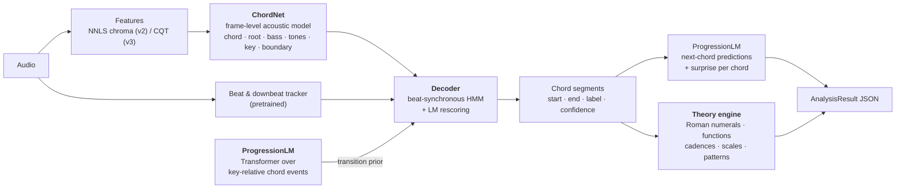
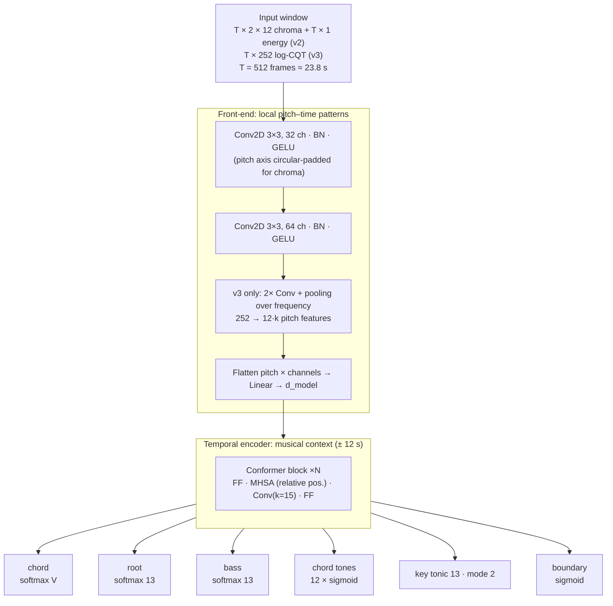
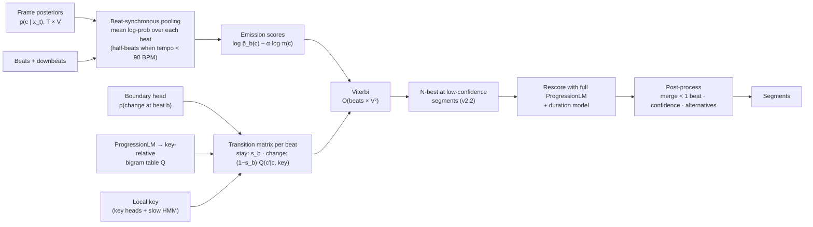
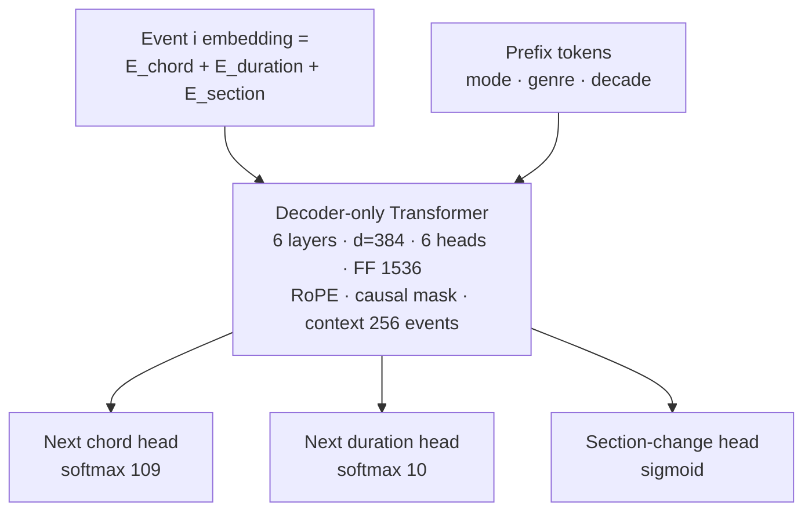
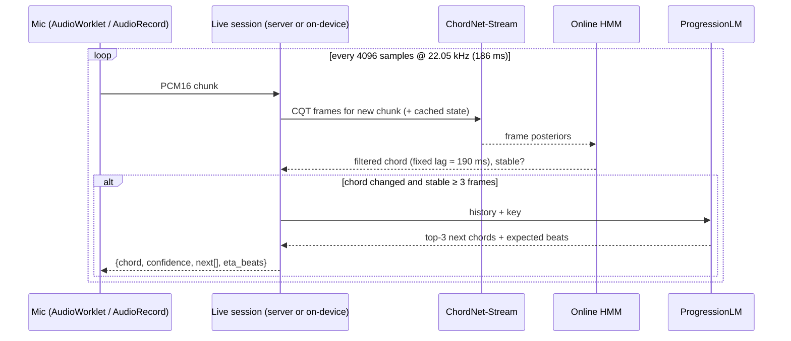

# 03 · Model architecture

> The AI side of the plan: which models exist, what each one computes, how they fit together, how they are trained and how we know they work.

## 0. The model family

Chord recognition is split the way speech recognition is: an **acoustic model** says what each 46 ms frame sounds like, a **language model** knows what usually comes next, and a **decoder** combines them into the most plausible sequence. Around that sit a pretrained beat tracker and a deterministic music-theory engine.



| Component | Trained by us? | Size | Phase |
|---|---|---|---|
| ChordNet-Chroma **v2** (NNLS chroma input) | Yes | ~3.7 M params | 1 |
| Decoder (HMM + LM rescoring) | Tuned (a few scalars) | — | 1, 2 |
| ProgressionLM | Yes | ~11 M params (n-gram baseline first) | 2 |
| Theory engine | Rules, no training | — | 2 |
| ChordNet-CQT **v3** (in-graph CQT, large vocab) | Yes | ~9 M params | 3 |
| ChordNet-Stream (causal v3 for live mode) | Yes (distilled from v3) | ~5 M params | 4 |
| Beat/downbeat tracker, optional source separation | No, pretrained | — | 1 |

## 1. Features

### 1.1 v2: NNLS "bothchroma" (compatible with Billboard)

```
audio → mono → resample to 44,100 Hz → Vamp nnls-chroma (block 16384, step 2048)
      → bass chroma (12) + treble chroma (12) at 21.53 frames/s (46.4 ms)
```

- **Must match Billboard exactly**: 44.1 kHz and hop 2048 (finding S1 in [01](01-current-state.md)). A golden test checks our extractor against Billboard's released `bothchroma.csv` (same frame times, correlated values) using a few public-domain or team-recorded tracks processed both ways.
- Normalisation, identical in training and serving (finding S2):
  - `bass /= max(bass)`, `treble /= max(treble)` per frame (shape only);
  - an extra **log-energy** channel `log(1e-3 + Σbass + Σtreble)`, z-scored per song, so the model can still tell silence (`N`) from a chord.
- Limitation: the plugin estimates tuning over the whole file and outputs its chroma only after it has seen the end, so **it cannot stream**. Live mode needs v3.

### 1.2 v3: constant-Q transform inside the model graph

```
audio → mono → 22,050 Hz → CQT: 3 bins/semitone, C1 − 6 st … C8 + 6 st (288 bins), hop 1024 (21.53 fps)
      → log1p(100·|CQT|) → per-song mean/variance normalisation (running estimate when streaming)
```

- Same **frame rate** as v2 (21.53 fps), so the decoder, beat pooling and every downstream component are shared.
- Implemented as fixed 1-D convolutions ([nnAudio](https://github.com/KinWaiCheuk/nnAudio)-style), so the CQT is **part of the exported ONNX graph**. The same file then runs on the server, in the browser (onnxruntime-web) and on Android, and the GPL-licensed Vamp plugin disappears from the serving path.
- The ±6-semitone margin lets training transpose by shifting the crop window by 3·*k* bins, which is exact and costs nothing.

## 2. ChordNet (acoustic model)

### 2.1 Architecture



| Config | Front-end | Encoder | d_model | Params | Use |
|---|---|---|---|---|---|
| `small` | 2 conv | 2 × BiGRU(128) | 256 | ~0.6 M | First Phase 1 iteration, CPU fallback |
| `base` (v2) | 2 conv | 4 × Conformer, 4 heads, FF 768 | 192 | ~3.7 M | Default server model |
| `large` (v3) | 4 conv + freq. pooling | 6 × Conformer, 4 heads, FF 1024 | 256 | ~9 M | Large vocabulary, audio domain |
| `stream` | causal conv | 6 × Conformer, chunked causal attention | 192 | ~5 M | Live mode |

**Why this shape:**

- **Frame-level outputs with a bidirectional sequence encoder** is how the strongest published systems work: CNN+RNN in McFee & Bello (2017), bidirectional Transformer in BTC (Park et al., 2019), Conformer in ChordFormer (2025). A chord is only identifiable in context: the same notes can be Am7 or C6 depending on the bass and on what surrounds them.
- **Conformer** = self-attention (long-range: "this is the same progression as 8 bars ago") + convolution (local: onsets, boundaries). The `small` BiGRU config is kept because it trains in minutes and is a sanity check for the pipeline.
- **Structured auxiliary heads** (root, bass, chord tones), following McFee & Bello: rare chords share structure with common ones (Gmaj9 shares root, bass and three tones with G), which is how large vocabularies stay learnable with little data. The bass head gives inversions (`C/E`) without multiplying the class count.
- **Key and boundary heads** are cheap multi-task signals that the decoder uses directly (§3).

### 2.2 Heads and losses

| Head | Output per frame | Target | Loss | Weight |
|---|---|---|---|---|
| `chord` | V-way softmax (tier: 25 / 61 / 170) | Vocabulary tier label; `X` masked | CE, label smoothing 0.1, quality weights `1/√freq` | 1.0 |
| `root` | 13-way (12 + N) | Root pitch class | CE | 0.5 |
| `bass` | 13-way | Bass pitch class | CE | 0.5 |
| `tones` | 12 sigmoids | Chord-tone pitch classes | BCE | 0.5 |
| `key_tonic` | 13-way (12 + none) | Local tonic | CE | 0.3 |
| `key_mode` | 2-way | major/minor, **masked when unknown** (Billboard) | CE | 0.2 |
| `boundary` | 1 sigmoid | 1 within ±1 frame of a chord change | BCE, pos_weight ≈ 10 | 0.5 |

Per-dataset masks switch off any head whose labels a dataset does not have.

### 2.3 Training recipe

| Item | Setting |
|---|---|
| Framework | PyTorch 2 + Lightning; export to ONNX (§8) |
| Batch | 32 random crops × 512 frames, songs sampled uniformly |
| Optimiser | AdamW, peak LR 1e-3, weight decay 0.01, 1k warm-up steps, cosine decay |
| Regularisation | Dropout 0.1, stochastic depth 0.1, EMA of weights (0.999), augmentation from [02 §5.4](02-datasets.md#54-augmentation-and-balancing-training-split-only) |
| Model selection | Every epoch: decode the validation songs and compute **mir_eval majmin WCSR**. Early stopping on that number, not on frame loss |
| v3 curriculum | Pre-train on synthetic (AAM, Slakh, our renders) → fine-tune on real audio (GuitarSet + own recordings) at 0.3× LR |
| Compute (rough estimate, to be measured) | v2: a few GPU-hours on a single T4/A10-class GPU (Colab/Kaggle is enough). v3: roughly 5–10× that |
| Reproducibility | Seeded runs, config files in git, data version from DVC, metrics + artifacts logged to MLflow (or W&B) |

### 2.4 Inference

Songs are processed in 512-frame windows with a 128-frame hop. The central 384 frames of each window are kept, so every frame is predicted with at least 6 s of context on both sides. Each window is one batched forward pass, which replaces the per-frame loop in v1 (finding B1).

## 3. Decoding: from frame posteriors to a chord timeline

Frame posteriors flicker. Musicians change chords on beats, and some chord sequences are far more likely than others. The decoder uses all three facts.



1. **Beat-synchronous pooling.** Average the frame log-posteriors inside each beat interval: $\bar{\ell}_b(c) = \frac{1}{|b|}\sum_{t\in b}\log p(c\mid x_t)$. A 4-minute song becomes ~450 beats instead of ~5,000 frames. If beat tracking is unreliable (tracker confidence low, rubato), fall back to frame-level decoding with a fixed self-transition.
2. **Emissions.** Posteriors are turned into scaled likelihoods by dividing by the class prior: $e_b(c) = \bar{\ell}_b(c) - \alpha \log \pi(c)$, with α ≈ 0.3–0.7 tuned on validation. This is the classic hybrid NN/HMM trick; it stops the decoder from always preferring C major.
3. **Transitions.**
   $P(c_b = c' \mid c_{b-1} = c) = s_b\,[c'=c] + (1-s_b)\,Q(\mathrm{rel}(c')\mid \mathrm{rel}(c), \mathrm{key})$,
   where $s_b$ is the probability of *no* change at beat *b* (from the boundary head, blended with a global prior) and *Q* is a key-relative chord-to-chord table **distilled from ProgressionLM**. Per Korzeniowski & Widmer (ISMIR 2018), harmonic language models help at the **chord-change level combined with a duration model**, not at the frame level, which is exactly how *Q* and $s_b$ are separated here.
4. **Viterbi.** Exact best path; ~450 beats × 25² states for `majmin` and ~450 × 170² for `large`. Both take milliseconds.
5. **LM rescoring (v2.2).** Where the best path is uncertain (segment confidence < 0.6), generate the N best alternatives and rescore them with the full Transformer: $\text{score} = \sum \log e + \lambda \log P_{LM}(c_i\mid c_{<i},\text{key}) + \mu \log P_{dur}(d_i\mid c_i)$. This is cheap because only a few spans are rescored.
6. **Post-processing.** Merge segments shorter than one beat into the neighbour with higher posterior mass. For each segment report `confidence` = mean posterior of the chosen label and `alternatives` = the next best labels by mean posterior (shown in the UI on hover).

## 4. Supporting models: beats and key

| Task | Choice | Notes |
|---|---|---|
| Beats + downbeats (offline) | **Beat This!** (Foscarin et al., ISMIR 2024), with madmom's RNN+DBN as a fallback/benchmark | Beat This! avoids the DBN post-processing and is PyTorch. madmom models are CC BY-NC-SA, so they are for benchmarking only if the app is commercial. Verify each checkpoint licence |
| Beats (live) | Online tracker (e.g. BeatNet's online mode) or simple autocorrelation tempo + phase-locked loop | Only needs "how many beats until the next change" |
| Key (local + global) | ChordNet's key heads → HMM over 24 keys with a very sticky self-transition (keys change rarely: 9 % of songs modulate at all) | Fallback: Krumhansl–Schmuckler / Temperley profile correlation on chroma. Global key = the key with most duration |
| Mode where unlabelled | Inferred from chord statistics (weight of I vs i, bIII, bVI, bVII) | Billboard has tonic but no mode |
| Source separation (optional) | HTDemucs (MIT) to drop drums/vocals before feature extraction | **Off by default**: heavy on CPU. Enable per request on GPU workers; keep only if it measurably improves WCSR |
| Sections (Phase 5) | Self-similarity of the chord sequence (repeated progressions) + energy novelty; label letters A/B/C, name hints from the section head of ProgressionLM | Billboard section labels give an evaluation set |

## 5. ProgressionLM (next-chord prediction)

### 5.1 What it has to do

1. **Suggest what comes next** (top-k chords with probabilities and expected duration), live or at any point of an analysed song.
2. **Provide the transition prior** *Q* for the decoder (§3).
3. **Score surprise**: $-\log_2 P(c_i \mid c_{<i})$ per chord, used to highlight unexpected changes (✦ in the UI).
4. **Power a songwriting endpoint** (`POST /api/v2/progressions/next`) for progressions typed by the user.

### 5.2 Representation: key-relative chord events

Every progression is transposed to its (local) key, and each chord change becomes one **event**:

```
prefix : <mode:major> <genre:rock> <decade:1980s>
events : [sec=intro] I·4  [sec=verse] I·4  V·4  vi·4  IV·4  I·4  V·4 ...
          └ chord token (degree × quality)   └ duration in beats (or <unk>)
```

| Field | Values | Notes |
|---|---|---|
| Chord token | 12 degrees × 9 quality classes (maj, min, 7, maj7, min7, dim, hdim7/dim7, aug, sus) + `N` = 109 | Degrees relative to the local tonic, e.g. `bVII:maj`, `ii:min7` |
| Duration | {½, 1, 2, 3, 4, 6, 8, 12, 16+} beats, or `<unk>` | Chordonomicon has no timing, so its loss on the duration head is masked |
| Section | intro, verse, pre-chorus, chorus, bridge, solo, outro, other, `<unk>` | From Billboard, Chordonomicon section tags |
| Prefix | mode, genre (~15), decade | Optional; dropped at random (p = 0.3) so the model works without them |

Key for data without key annotations (most of Chordonomicon) is estimated by picking the key (of 24) under which the progression is most likely according to a key-relative bigram trained on keyed data (Billboard, ChoCo). Low-confidence songs are flagged and down-weighted.

### 5.3 Architecture



- **~11 M parameters, context 256 chord events.** A median Billboard song has ~90 chord changes (p90: 171), so the whole history fits for almost every song (longer songs use a sliding window). That is what lets attention "copy" the song's own loop (the +29-point effect in [02 §2.5](02-datasets.md#25-progressions-are-predictable-and-even-more-so-within-a-song)).
- Trained on Chordonomicon + ChoCo symbolic partitions + Billboard/Isophonics **train splits**; roughly 700 k songs and 60 M events, so a few GPU-hours per epoch at this size (estimate).
- Output in absolute terms by transposing back into the song's key, e.g. `vi:min7` in D major → `Bm7`.

### 5.4 Baseline that ships first

Before the Transformer exists (Phase 2 start), the same API is served by the **key-relative 4-gram + same-song cache** measured in [02 §2.5](02-datasets.md#25-progressions-are-predictable-and-even-more-so-within-a-song) (80.1 % top-1, 93.3 % top-3 on held-out Billboard songs). It is a few hundred kilobytes of counts, fully explainable, and small enough to run on-device. The Transformer must beat it to ship.

### 5.5 Theory engine (explanations and "scales and stuff")

A deterministic module, `chordify_core.theory`, turns a chord in a key into things a musician understands. It explains predictions but never makes them.

| Output | Example (D major) |
|---|---|
| Roman numeral + function | `A7sus4` → **V**, dominant; `Bm7` → **vi**, tonic family; `C` → **bVII**, borrowed from D Mixolydian |
| Cadences | V→I authentic · IV→I plagal · V→vi deceptive · …→V half |
| Secondary dominants | `E7` → **V/V** (resolves to A) |
| Named patterns | I–V–vi–IV "Axis" · I–vi–IV–V "'50s" · ii–V–I · i–bVII–bVI–V "Andalusian" · 12-bar blues |
| Scale to play over the chord | V → A Mixolydian; vi → B Aeolian; with pentatonic simplifications for beginners |
| Guitar helpers | Chord diagrams, capo suggestion (the transposition with the fewest barre chords), "simplify" (large vocab → triads) |

Each prediction gets a short reason, e.g. *"followed this context 9× earlier in the song; deceptive cadence V→vi"*. That text is taken from the [mockup](06-frontend-visualization.md), where it is computed from real Billboard data.

## 6. Live mode (streaming)



- **Causal model**: causal convolutions and chunked attention (8-frame chunks = 372 ms, 3 s left context, no look-ahead beyond the chunk), **distilled** from the offline v3 model (teacher posteriors at temperature 2 + ground-truth labels).
- **Online decoding**: HMM forward filtering with a fixed lag of 4 frames, plus hysteresis: the displayed chord only changes when the new chord has held > 0.6 probability for ≥ 3 frames. This prevents flicker.
- **Latency budget**: 186 ms capture chunk + ~50 ms network + ~30 ms compute + ~190 ms smoothing lag ≈ **0.45 s**, under the 0.5 s target. On-device inference (Phase 5) removes the network term.
- At the start of a song there is no history, so predictions come from the corpus prior. This is where key-relative modelling matters most (+11 points top-1 over absolute names at bigram level).

## 7. Evaluation

### 7.1 Metrics

| Area | Metric | Tool |
|---|---|---|
| Chord timeline | **WCSR** (weighted chord symbol recall) at `root`, `majmin`, `majmin_inv`, `sevenths`, `sevenths_inv`, `mirex` | `mir_eval.chord` |
| Segmentation | Over/under-segmentation and `seg` = min(1−over, 1−under) (directional Hamming) | `mir_eval.chord` |
| Key | MIREX weighted key score | `mir_eval.key` |
| Beats | F-measure (±70 ms) | `mir_eval.beat` |
| Single chord (app input) | Accuracy on the Chordify-Live clips ([02 §6](02-datasets.md#6-the-in-domain-test-set-we-must-record-ourselves)) | own script |
| Next chord | Top-1 / top-3 accuracy, perplexity, calibration (ECE), **cold-start** (first 8 changes of a song) | own script |
| System | p50/p95 analysis time for a 4-min song, real-time factor, live display latency | load test |

### 7.2 Baselines and ship gates

Every number is measured on the **frozen test splits**. No model ships if it is worse than the version it replaces.

| Gate | Baseline to beat | Target |
|---|---|---|
| v2 on Billboard test, `majmin` WCSR | v1 (measured in Phase 0 via sliding window) and **Chordino** (same NNLS features + HMM, run through Vamp) | ≥ Chordino + 3 points; strong published systems land roughly in the high-70s to mid-80s on pop corpora like this |
| v2 segmentation `seg` | Chordino | ≥ 0.80 |
| v2 on Chordify-Live, single chord | v1 on the same clips | ≥ 85 % |
| v3 on GuitarSet test players + Chordify-Live progressions, `majmin` WCSR | v2 on the same audio | ≥ v2 + 3 points, and `sevenths` WCSR reported |
| Key (Billboard tonic, Isophonics key+mode) | Krumhansl–Schmuckler on chroma | ≥ 0.80 weighted score |
| ProgressionLM, Billboard test (key-relative, `majmin`) | 4-gram + song cache: **80.1 % / 93.3 %** | Top-1 ≥ 82 %, top-3 ≥ 94 %, cold-start top-3 ≥ 80 % |
| Analysis latency, 4-min song, CPU worker, no separation | — | p95 ≤ 20 s |
| Live latency (chord change → UI) | — | ≤ 0.5 s |

Upper bound to keep in mind: expert annotators disagree on a noticeable fraction of chord labels (the Chordify Annotator Subjectivity dataset exists to measure this), so 100 % is not a meaningful target.

## 8. Export, packaging and versioning

A trained model ships as an immutable **model bundle**:

```
models/chordnet-chroma/2.0.0/
  model.onnx            opset ≥ 17, dynamic time axis
  bundle.json           feature params (sr, hop, bins, normalisation), frame rate, vocab tier + label list,
                        head names, decoder params (α, self-transition prior, λ, μ), training data version,
                        test metrics, sha256 of every file
  transitions.npy       key-relative transition table Q distilled from ProgressionLM
  MODEL_CARD.md         data, intended use, known failure modes, licences of training data
```

- **Serving** uses ONNX Runtime (CPU by default, CUDA EP on GPU workers). The TensorFlow dependency disappears from the backend, and the same ONNX file runs in onnxruntime-web and ONNX Runtime Mobile for Phase 5.
- `models/registry.yaml` lists the active bundle per role (`chord`, `lm`, `beats`). Each `AnalysisResult` records the bundle ids that produced it, which also makes up the cache key (a new model means re-analysis, never stale results).
- **Framework choice.** We recommend moving training to **PyTorch** because the reference implementations and pretrained parts we rely on (BTC, ChordFormer, Beat This!, Demucs, nnAudio) are PyTorch, and ONNX export decouples serving from training. If the team prefers to keep Keras, **Keras 3 with the PyTorch backend** preserves the Keras API; serving through ONNX is identical either way. This is decision D1 in the [README](README.md#open-decisions).

## 9. References

- Burgoyne, Wild & Fujinaga. *An expert ground truth set for audio chord recognition and music analysis.* ISMIR 2011. (McGill Billboard)
- Mauch & Dixon. *Approximate note transcription for the improved identification of difficult chords.* ISMIR 2010. (NNLS Chroma / Chordino)
- Harte et al. *Symbolic representation of musical chords: a proposed syntax for text annotations.* ISMIR 2005.
- Humphrey & Bello. *Four timely insights on automatic chord estimation.* ISMIR 2015.
- Korzeniowski & Widmer. *Feature learning for chord recognition: the deep chroma extractor.* ISMIR 2016.
- McFee & Bello. *Structured training for large-vocabulary chord recognition.* ISMIR 2017.
- Korzeniowski & Widmer. *Improved chord recognition by combining duration and harmonic language models.* ISMIR 2018.
- Park et al. *A bi-directional transformer for musical chord recognition.* ISMIR 2019. (BTC)
- Jiang et al. *Large-vocabulary chord transcription via chord structure decomposition.* ISMIR 2019.
- Pauwels et al. *20 years of automatic chord recognition from audio.* ISMIR 2019.
- Gulati et al. *Conformer: convolution-augmented transformer for speech recognition.* Interspeech 2020.
- *ChordFormer: a Conformer-based architecture for large-vocabulary audio chord recognition.* 2025.
- Foscarin, Schlüter & Widmer. *Beat this! Accurate beat tracking without DBN postprocessing.* ISMIR 2024.
- Böck et al. *madmom: a new Python audio and music signal processing library.* ACM MM 2016.
- Xi et al. *GuitarSet: a dataset for guitar transcription.* ISMIR 2018.
- de Berardinis et al. *ChoCo: a chord corpus and a data transformation workflow for musical harmony knowledge graphs.* Scientific Data, 2023.
- Kantarelis et al. *Chordonomicon: a dataset of 666,000 songs and their chord progressions.* 2024.
- Raffel et al. *mir_eval: a transparent implementation of common MIR metrics.* ISMIR 2014.
