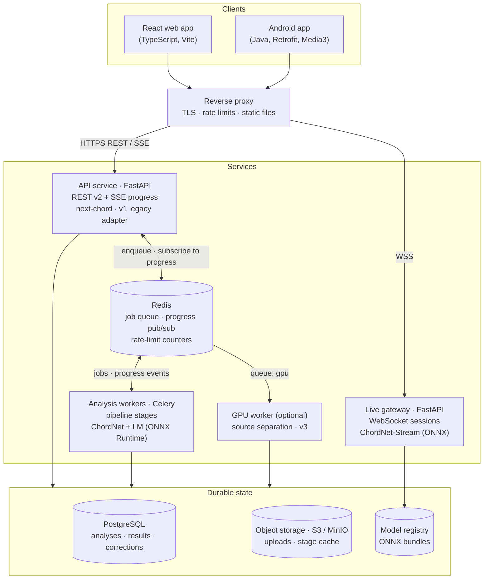
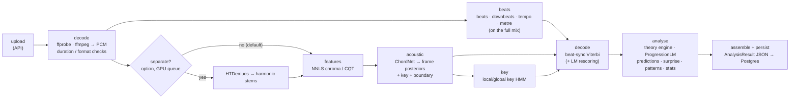
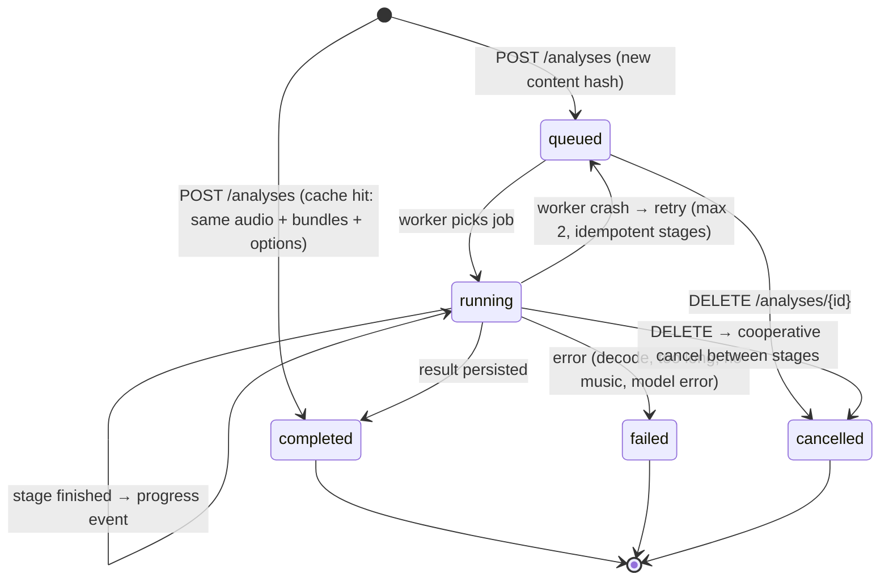
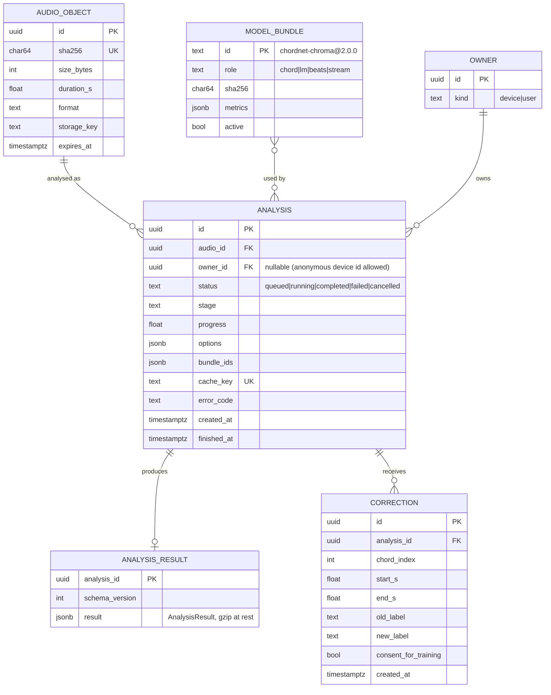
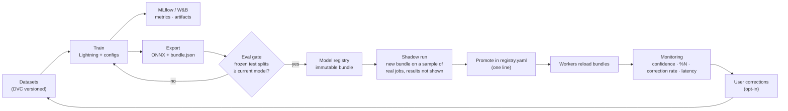

# 04 · Software architecture

> How the services are cut, where each piece of code lives, how a song flows through the system, and how models get from a training run into production.

## 1. System overview



| Component | Responsibility | Scales by |
|---|---|---|
| **API service** | Validate uploads, dedupe by content hash, create analyses, stream progress (SSE), serve results/exports, next-chord endpoint (ProgressionLM runs in-process, it is small), v1 compatibility | Stateless; add replicas |
| **Analysis workers** | Run the pipeline stages in [§3](#3-the-analysis-pipeline-as-a-job); load model bundles once per process | Number of worker processes; queue depth is the autoscaling signal |
| **GPU worker** (optional) | Source separation, v3 large model when enabled | One GPU box; separate `gpu` queue |
| **Live gateway** | Hold WebSocket sessions, incremental features, causal model, online HMM, LM suggestions | Sessions per CPU core (connections are sticky by nature) |
| **PostgreSQL** | Durable state: analyses, results (JSONB), corrections, model registry index | Vertical; results are small (~50–200 kB each) |
| **Redis** | Celery broker, progress pub/sub + last-known progress, rate-limit counters | Single instance is plenty |
| **Object storage** | Uploaded audio (short retention), per-stage cache (features, beats, posteriors) | S3/MinIO |

Why an **async job** instead of the current synchronous endpoints: a full song takes seconds to a minute (much more with source separation). Mobile connections drop, users leave the page, and we want progress, retries, cancellation and caching. Short, cheap calls (next chord, health, results) stay synchronous.

## 2. Repository layout

The existing top-level folders stay, so history and muscle memory are preserved. One shared package is added, and the backend is split into API, worker and live modules.

```
Chordify/
├─ chordify_core/               NEW · pip-installable library used by training AND serving
│  ├─ audio.py                  decode (ffmpeg), resample, loudness
│  ├─ features/                 nnls.py (Vamp, 44.1k/2048) · cqt.py · normalise.py
│  ├─ vocab.py                  Harte parsing, pitch-class maths, vocabulary tiers & reductions
│  ├─ decode/                   beat_sync.py · viterbi.py · rescoring.py · postprocess.py
│  ├─ theory/                   keys · roman · functions · cadences · patterns · scales · guitar
│  ├─ lm/                       ngram.py (baseline) · onnx_lm.py (Transformer runtime)
│  └─ bundle.py                 load + verify model bundles (sha256, schema)
├─ chordify_ai/                 training & research (restructured)
│  ├─ data/                     ingest_billboard.py · ingest_guitarset.py · ingest_choco.py · synth/
│  ├─ models/                   chordnet.py · progression_lm.py
│  ├─ train/                    train_chordnet.py · train_lm.py · configs/*.yaml
│  ├─ eval/                     eval_chords.py · eval_lm.py · baselines/chordino.py
│  └─ export/                   to_onnx.py · make_bundle.py
├─ chordify_backend/
│  ├─ app/api/                  analyses.py · progressions.py · live.py · v1_legacy.py · health.py
│  ├─ app/worker/               celery_app.py · pipeline.py · stages/*.py
│  ├─ app/live/                 session.py · stream_model.py
│  ├─ app/db/                   models.py (SQLAlchemy) · migrations/ (Alembic)
│  ├─ app/schemas.py            Pydantic models = the API contract (OpenAPI is generated from them)
│  └─ pyproject.toml            real, pinned dependencies (replaces the UTF-16 requirements.txt)
├─ chordify-frontend/           React → TypeScript (see 06)
├─ Mobile/                      Android
├─ models/registry.yaml         active bundle per role; weights live in the registry, not in git
├─ data/                        DVC-tracked datasets and features
├─ docs/
└─ compose.yaml                 local stack: api, worker, live, redis, postgres, minio, web
```

The key rule is that **feature extraction, vocabulary and decoding exist exactly once**, in `chordify_core`. Training imports it, serving imports it, and tests pin it. That structurally removes the train/serve skew found in the audit (S1, S2, S4).

## 3. The analysis pipeline as a job

### 3.1 Stages



| Stage | Output (cached in object storage, keyed by `sha256(audio) + stage version`) | Progress weight |
|---|---|---|
| decode | 44.1 kHz mono PCM (float32), duration, loudness | 5 % |
| beats | beats, downbeats, tempo curve, metre, tracker confidence | 15 % |
| features | `T × F` float16 matrix | 25 % |
| acoustic | frame posteriors for every head | 20 % |
| key | local key segments, global key | 5 % |
| decode | chord segments with confidence + alternatives | 10 % |
| analyse | Roman numerals, functions, predictions, surprise, patterns, stats | 15 % |
| assemble | final JSON, persisted | 5 % |

Beats and features run **in parallel** (both need only decoded audio). Beat tracking uses the full mix (drums help); features use separated harmonic stems when separation is on.

**Stage caching** means changing only the decoder or the LM re-runs only the last stages, which is also how we re-analyse the whole history cheaply after a model upgrade.

### 3.2 Job lifecycle



- **Idempotency.** `cache_key = sha256(audio) + active bundle ids + normalised options`. Uploading the same song twice returns the existing analysis immediately. Every stage writes its output atomically, so a retried job resumes from the last completed stage.
- **Time limits.** Soft limit 5 min, hard limit 10 min per job; audio longer than 15 min is rejected up front.
- **Progress events** are published to Redis channel `analysis:{id}`, and the last event is kept in a Redis hash. When the SSE endpoint connects or reconnects, it first sends the stored snapshot and then relays live events ([05 §4](05-api-and-communication.md#4-progress-server-sent-events)).

### 3.3 Performance budget (4-minute song, 4-vCPU worker, to be measured in Phase 1)

| Stage | Rough estimate |
|---|---|
| decode + resample | ~1 s |
| NNLS chroma (native Vamp plugin) | ~3–6 s |
| beats (CPU) | ~3–8 s |
| ChordNet v2 (ONNX, batched windows) | < 1 s |
| key + Viterbi | < 0.2 s |
| ProgressionLM for ~90 chord events + theory | < 1 s |
| **Total without separation** | **~10–15 s** (target p95 ≤ 20 s) |
| + HTDemucs | about the song's length or more on CPU; seconds on a GPU |

Because beats and features run in parallel, wall-clock time is below the sum. Partial results are streamed (beats first, then chords) so the UI is useful before the job finishes.

## 4. Data model



- **Results are one JSONB document** (`AnalysisResult`, schema in [05 §5](05-api-and-communication.md#5-the-analysisresult-document)). They are read as a whole, never queried chord by chord.
- **Corrections** are the seed of the active-learning loop (§6). They are used for training only when `consent_for_training` is true.
- Accounts are optional: a random **device id** gives anonymous history from day one; real accounts can come later without schema changes (`OWNER.kind`).

## 5. Storage, retention and privacy

| Data | Where | Retention |
|---|---|---|
| Uploaded audio | Object storage `audio/{sha256}` | **24 h** by default (enough for retries and re-analysis); the client keeps its own copy for playback |
| Stage cache (features, posteriors) | Object storage `cache/{stage}@{version}/{sha256}` | 30 days, LRU |
| Analysis results | Postgres | Until the owner deletes them |
| Corrections | Postgres | Until deleted; used for training only with consent |
| Live-mode audio | Memory only | Never stored |

Users upload commercial songs, so the server keeps **derived analysis, not the recording**. Playback in the web and Android apps uses the local file. On another device, history shows the timeline, and the user can re-attach the file: it is matched by SHA-256, so the right analysis re-links.

## 6. MLOps: from experiment to production and back



- **Eval gate** = the ship gates in [03 §7.2](03-models.md#72-baselines-and-ship-gates), run automatically by `chordify_ai/eval`.
- **Shadow runs** compare the new and old bundles on real traffic (agreement rate, confidence, latency) before users see any change.
- **Monitoring signals that the model is struggling:** mean segment confidence drops, the `N` share jumps (decode or feature bug), and the correction rate per 100 chords rises.

## 7. Deployment

| Environment | Shape |
|---|---|
| **Local dev** | `docker compose up`: api, worker, live, redis, postgres, minio, web (Vite dev server). Models are pulled from the registry into a volume on first start |
| **Staging/prod (small)** | One VM: the same containers behind Caddy/Traefik (automatic TLS); managed Postgres if available; the static web build is served from the proxy or a CDN |
| **Optional GPU** | One GPU VM running only the `gpu` Celery queue (separation, v3 large). Everything works without it |
| **Later** | Kubernetes only if traffic requires it; the services are already stateless except Postgres/Redis/object storage |

Configuration is environment-only (`CHORDIFY_DATABASE_URL`, `CHORDIFY_REDIS_URL`, `CHORDIFY_S3_*`, `CHORDIFY_ALLOWED_ORIGINS`, `CHORDIFY_MAX_UPLOAD_MB`…), following twelve-factor conventions. Clients read the API base URL from build config (web: `VITE_API_BASE_URL`; Android: `BuildConfig.API_BASE_URL` plus the existing settings screen).

## 8. Observability

- **Logs:** structured JSON, always with `analysis_id` / `session_id` and bundle ids.
- **Metrics (Prometheus):** request rate/latency per endpoint, queue depth, per-stage duration histograms, job failures by `error_code`, live-session count and end-to-end latency, model confidence histogram, `N` share, correction rate.
- **Tracing (OpenTelemetry):** one trace per analysis, from the API through Celery stages.
- **Client errors:** Sentry (web + Android).

## 9. Security

- Upload limits enforced at the proxy **and** the API: 50 MB, 15 min of audio; format detected with `ffprobe` (magic bytes), not the file extension.
- Decoding runs in a subprocess with CPU/time limits; malformed files cannot take a worker down.
- Rate limits per device id / IP (e.g. 20 analyses per hour anonymous); live sessions are capped at 10 min and one per device.
- CORS allow-list from config; HTTPS everywhere; Android cleartext is allowed only in debug builds.
- Deleting an analysis deletes its result, corrections and any cached derivatives; the audio object expires by itself.

## 10. Testing and CI

| Layer | What is tested | How |
|---|---|---|
| `chordify_core` | Harte parsing & reductions, transposition, theory rules, Viterbi on synthetic posteriors | pytest, property-based tests (Hypothesis) for transposition invariance |
| Features (golden) | NNLS output frame rate/hop and scale against Billboard `bothchroma.csv` conventions; CQT shape | pytest with small fixture files |
| Model regression | A tiny frozen eval set (~10 songs' features) must not lose WCSR beyond tolerance | pytest, < 2 min on CPU in CI |
| API contract | Responses validate against the OpenAPI schema; v1 adapter still returns v1 shapes | pytest + schemathesis |
| Worker pipeline | Upload → result for a 15 s public-domain clip, with stage caching and retry | docker compose in CI |
| Web | Components render the fixture `AnalysisResult` (the mockup data); playback sync logic | Vitest + Testing Library; Playwright e2e |
| Android | Retrofit models parse fixtures; polling/SSE fallback | JUnit + MockWebServer |

CI (GitHub Actions): `ruff` + `mypy`, `eslint` + `tsc`, unit and contract tests, Docker image builds on every PR; the full model evaluation runs nightly or on demand.
