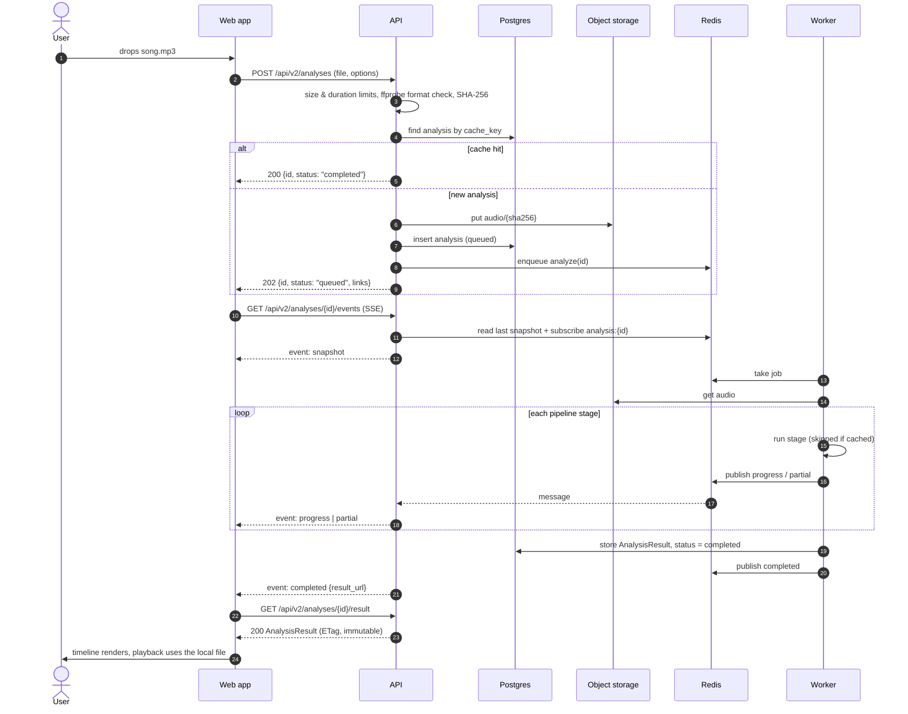
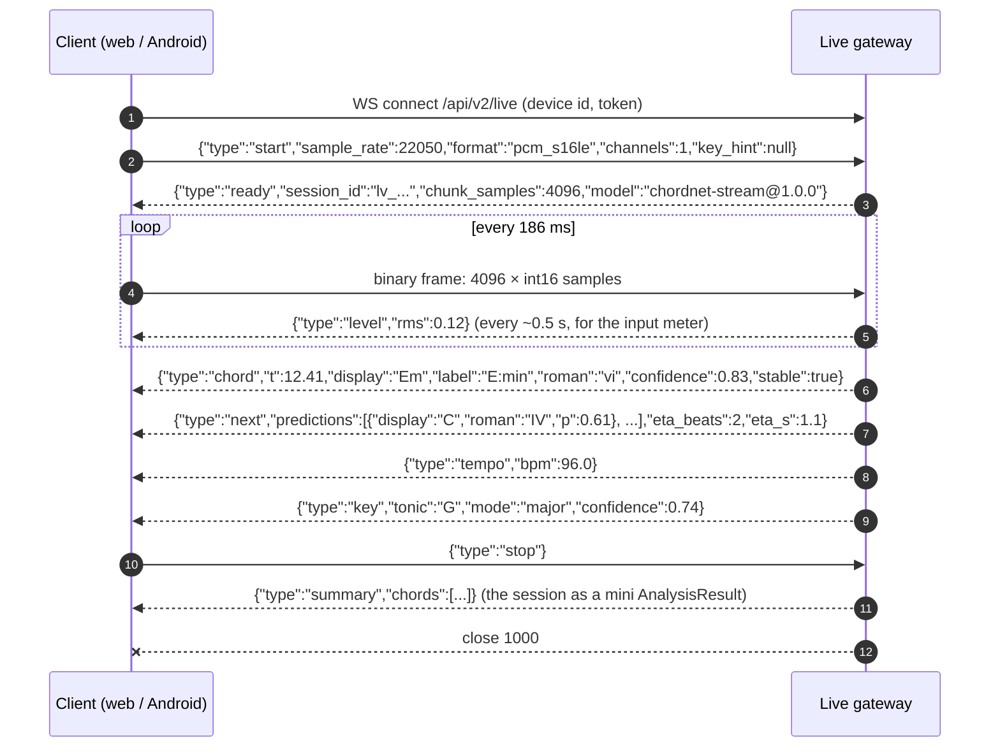
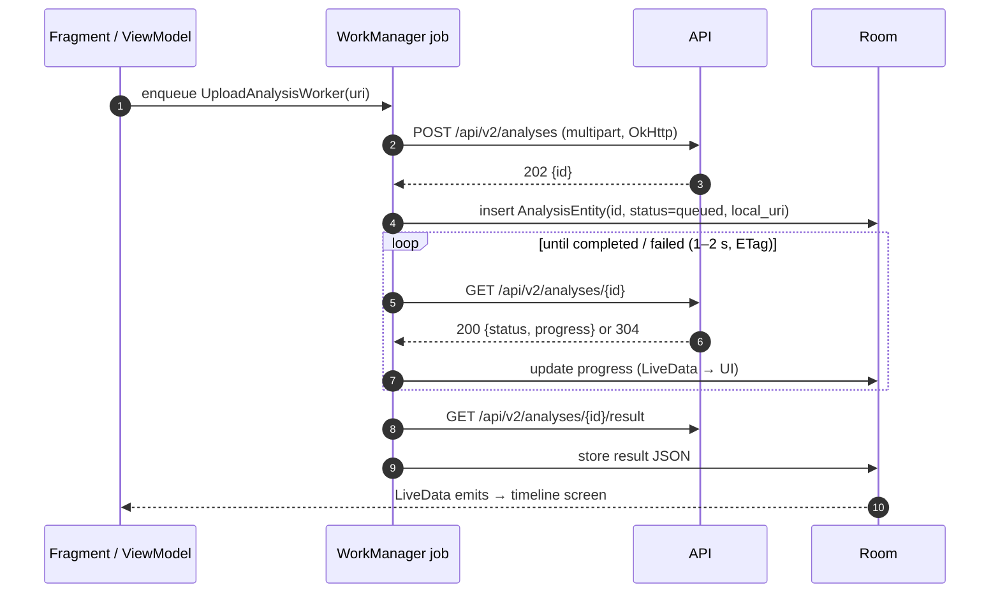

# 05 · API and communication

> The contract between the React app, the Android app, the backend and the models: endpoints, message flows, payloads, errors and versioning.

## 1. Principles

- **Contract-first.** Pydantic models in `chordify_backend/app/schemas.py` are the single source of truth. FastAPI generates the OpenAPI document from them; the web app generates TypeScript types from that (`openapi-typescript`), and backend tests emit JSON fixtures that the web and Android tests parse. A breaking change fails CI on all three sides.
- **One transport per job:**

  | Interaction | Transport | Why |
  |---|---|---|
  | Upload, results, history, next-chord, exports | HTTPS REST (JSON; multipart for upload) | Simple, cacheable, works everywhere |
  | Analysis progress | **Server-Sent Events** (fallback: polling with ETag) | One-way server→client, auto-reconnect with `Last-Event-ID`, plain HTTP through proxies |
  | Live mode | **WebSocket** | Bidirectional and low-latency: audio up, chord events down |

- **Versioned paths** (`/api/v2/...`). Within v2, changes are additive only; clients ignore unknown fields and must tolerate new enum values.
- **Errors** use RFC 9457 `application/problem+json` with a stable machine-readable `code`.

## 2. Endpoints

| Method & path | Purpose | Response |
|---|---|---|
| `POST /api/v2/analyses` | Upload audio (multipart `file` + `options` JSON) and start an analysis | `202` `{id, status:"queued", links}` · `200` if the same audio+models+options already exist (cache hit) |
| `GET /api/v2/analyses/{id}` | Status: `status`, `stage`, `progress`, `error` | `200` + `ETag` (`304` when unchanged) |
| `GET /api/v2/analyses/{id}/events` | Progress stream (SSE) | `text/event-stream` |
| `GET /api/v2/analyses/{id}/result` | The `AnalysisResult` document | `200`, immutable (`ETag` = cache key) |
| `GET /api/v2/analyses/{id}/export?format=` | `lab`, `jams`, `chordpro`, `midi` (later `musicxml`, `pdf`) | file |
| `GET /api/v2/analyses?cursor=` | History for the current device/user | paginated list |
| `DELETE /api/v2/analyses/{id}` | Cancel if running, delete result and derivatives | `204` |
| `POST /api/v2/analyses/{id}/corrections` | User fixes a chord (`chord_index`, `new_label`, optional `start`/`end`, `consent_for_training`) | `201` |
| `POST /api/v2/progressions/next` | Next-chord suggestions for a typed or live progression | `200` (see §6) |
| `GET /api/v2/models` | Active model bundles, vocabularies, limits | `200` |
| `WS /api/v2/live` | Live chord recognition + predictions (see §7) | WebSocket |
| `GET /healthz`, `GET /readyz` | Liveness; readiness = DB, Redis and model bundles loaded | `200`/`503` |
| `POST /predict`, `/predict_time_stamps`, `/extract_full_chroma` | **v1, deprecated**, served by an adapter (§8) | v1 shapes |

`options` for `POST /api/v2/analyses`:

```jsonc
{
  "vocabulary": "majmin",          // "majmin" | "sevenths" | "large" (availability per model: GET /models)
  "separate_sources": false,       // HTTP 422 if no GPU worker is configured
  "predictions": true,             // compute next-chord predictions + surprise
  "min_segment_beats": 1
}
```

## 3. Flow: analyse an uploaded song (web)



The web app keeps the `File` object it uploaded and plays it locally with a blob URL, so the server never streams copyrighted audio back.

## 4. Progress: Server-Sent Events

```
GET /api/v2/analyses/an_01J9.../events
Accept: text/event-stream

event: snapshot
id: 3
data: {"status":"running","stage":"features","progress":0.32}

event: progress
id: 4
data: {"stage":"acoustic","progress":0.55}

event: partial
id: 5
data: {"kind":"beats","tempo":{"bpm":110.5,"meter":"4/4"},"beats_url":"/api/v2/analyses/an_01J9.../result?part=beats"}

event: progress
id: 6
data: {"stage":"analyse","progress":0.9}

event: completed
id: 7
data: {"result_url":"/api/v2/analyses/an_01J9.../result"}

: keep-alive (comment line every 15 s)
```

| Event | Payload | Client reaction |
|---|---|---|
| `snapshot` | Full current status (always first after (re)connect) | Render progress |
| `progress` | `stage`, `progress` 0–1 | Update progress bar and stage label |
| `partial` | `kind` = `beats` or `chords`, plus a URL to that part | Progressive rendering: beat grid first, then chords before predictions arrive |
| `completed` | `result_url` | Fetch the result, close the stream |
| `failed` | `{code, message}` | Show the error, offer retry |

Reconnect uses the standard `Last-Event-ID` header. Proxies must not buffer (`X-Accel-Buffering: no`). Clients without SSE support (older Android code paths) poll `GET /api/v2/analyses/{id}` every 1–2 s with `If-None-Match` and receive `304` until something changes.

## 5. The `AnalysisResult` document

This is what every screen renders. The [mockup](mockup/analysis-view.html) embeds a real instance generated from a Billboard annotation, so this schema is already exercised by working UI code.

```ts
interface AnalysisResult {
  schema_version: 1;
  analysis_id: string;
  status: "completed";
  source: { filename?: string; title?: string; artist?: string; duration: number; sha256: string };
  models: { chord: string; lm: string; beats: string; vocabulary: "majmin" | "sevenths" | "large" };
  tempo: { bpm: number; meter: string; confidence: number };
  key: {
    global: Key;
    segments: Array<Key & { start: number; end: number }>;   // local keys (modulations)
  };
  beats: number[];                  // seconds
  downbeats: number[];              // seconds (bar starts)
  bars: Array<{ start: number; end: number; chords: string[] }>;  // lead-sheet view
  sections: Array<{ letter: string; label: string; start: number; end: number }>;
  chords: ChordSegment[];
  summary: {
    unique_chords: number;
    time_share: Array<{ display: string; seconds: number; share: number }>;
    patterns: Array<{ roman: string[]; name: string | null; count: number }>;
    predictability?: number;        // mean P(actual next) under ProgressionLM
  };
}

interface Key { tonic: string; mode: "major" | "minor" | "unknown"; confidence: number }

interface ChordSegment {
  index: number;
  start: number; end: number;       // seconds, snapped to beats
  beats: number;                    // duration in beats
  label: string;                    // Harte, e.g. "A:sus4(b7)", "N"
  display: string;                  // "A7sus4", "N.C."
  root?: string; quality?: string; bass?: string;
  roman?: string;                   // relative to the local key: "V", "vi", "bVII", "V/V"
  function?: "tonic" | "subdominant" | "dominant" | "borrowed";   // may grow: treat unknown as neutral
  scale_hint?: string;              // "A Mixolydian"
  confidence: number;               // 0–1, mean posterior of the chosen label
  alternatives?: Array<{ label: string; display: string; p: number }>;
  next?: Prediction[];              // top-3 predictions made at this chord
  surprise?: number;                // -log2 P(this chord | history)
}

interface Prediction {
  label: string; display: string; roman: string;
  p: number;                        // 0–1
  expected_beats?: number;
  reason: string;                   // "followed this context 9× earlier in the song; deceptive cadence V→vi"
}
```

Size: a 4-minute song is ~500 beats and ~100 chords, which is 50–100 kB of JSON (≈10–20 kB gzipped).

## 6. Next-chord endpoint

Used by the songwriting helper, the "what comes next?" practice game and any client that has a progression but no audio.

```http
POST /api/v2/progressions/next
Content-Type: application/json

{
  "chords": ["G", "D", "Em"],
  "durations_beats": [4, 4, 4],
  "key": null,
  "section": "chorus",
  "k": 3
}
```

```json
{
  "key_used": { "tonic": "G", "mode": "major", "estimated": true, "confidence": 0.86 },
  "predictions": [
    { "display": "C",  "label": "C:maj", "roman": "IV", "p": 0.58, "expected_beats": 4,
      "reason": "I–V–vi–IV (the “Axis” progression) continues with IV" },
    { "display": "Bm", "label": "B:min", "roman": "iii", "p": 0.12, "expected_beats": 4,
      "reason": "vi→iii, descending-thirds motion" },
    { "display": "G",  "label": "G:maj", "roman": "I",  "p": 0.09, "expected_beats": 4,
      "reason": "return to the tonic" }
  ],
  "model": "progression-lm@1.0.0"
}
```

(The values in this example are illustrative.) If `key` is null, the key is estimated from the chords (§5.2 of [03](03-models.md#52-representation-key-relative-chord-events)) and returned with its confidence, so the UI can say "assuming G major" and let the user override it. The endpoint is synchronous and fast (one small Transformer forward pass, or the n-gram baseline), so it lives in the API process.

## 7. Live mode: WebSocket protocol



| Rule | Value |
|---|---|
| Audio format | PCM signed 16-bit little-endian, mono, **22,050 Hz**, 4,096-sample binary frames (≈186 ms, 8 kB) → ~44 kB/s upstream |
| Capture | Web: `AudioWorklet` at the device rate (usually 48 kHz), resampled to 22.05 kHz in the worklet. Android: `AudioRecord` at 22,050 Hz (or 44.1 kHz decimated by 2) |
| Timestamps | `t` = seconds since `start`, derived from the number of samples received (not wall clock), so network jitter never skews the timeline |
| Backpressure | If the client falls behind, the gateway processes the newest audio and drops stale chunks. It sends `{"type":"warning","code":"LAGGING"}` so the UI can show it |
| Limits | 10-minute sessions, one per device, idle timeout 20 s |
| Reconnect | Client reconnects with `{"type":"resume","session_id":...}` within 30 s to keep history (the LM context) |
| Privacy | Audio is processed in memory and never stored |

Later (Phase 5) the same message types are produced **on the device**: onnxruntime-web and ONNX Runtime Mobile run ChordNet-Stream locally, and the UI code does not change.

## 8. Backwards compatibility with v1

The current Android app and web app keep working during the migration:

| v1 endpoint | Served by | Notes |
|---|---|---|
| `POST /predict` | "Single chord" path: decode → features → ChordNet → average the chord posteriors over frames weighted by `1 − p(N)` → best label | Same response shape `{chord, confidence}` (confidence 0–100) |
| `POST /predict_time_stamps` | Same path per slice | Same `{segments:[...]}` shape |
| `POST /extract_full_chroma` | Renders the PNG from the cached feature matrix | Kept only until clients switch |

The adapter adds `Deprecation: true` and `Sunset: <date>` headers. The v1 endpoints are removed once the Android release that uses v2 has been out for one version cycle ([roadmap](07-roadmap.md), Phase 3).

## 9. Android flow



WorkManager survives the app going to the background and network changes. An SSE client (`okhttp-sse`) can replace polling later without changing the UI layer.

## 10. Error model

```json
{
  "type": "https://chordify.app/errors/audio-too-long",
  "title": "Audio is too long",
  "status": 422,
  "code": "AUDIO_TOO_LONG",
  "detail": "The file is 23 min long; the limit is 15 min.",
  "instance": "/api/v2/analyses"
}
```

| `code` | HTTP | When |
|---|---|---|
| `UNSUPPORTED_MEDIA_TYPE` | 415 | `ffprobe` finds no audio stream |
| `PAYLOAD_TOO_LARGE` | 413 | Upload > 50 MB |
| `AUDIO_TOO_LONG` | 422 | Duration > 15 min |
| `DECODE_FAILED` | 422 / job `failed` | Corrupt or truncated file |
| `NO_MUSIC_DETECTED` | job `failed` | > 90 % of frames are `N` |
| `OPTION_UNAVAILABLE` | 422 | e.g. `separate_sources` without a GPU worker, or a vocabulary the active model lacks |
| `RATE_LIMITED` | 429 | With `Retry-After` |
| `NOT_FOUND` | 404 | Unknown or deleted analysis |
| `MODEL_UNAVAILABLE` | 503 | Bundles not loaded (readiness fails too) |
| `INTERNAL` | 500 | Anything else, with a correlation id |

Job failures appear as `status: "failed"` with `error: {code, message}` in both the status endpoint and the SSE `failed` event.
