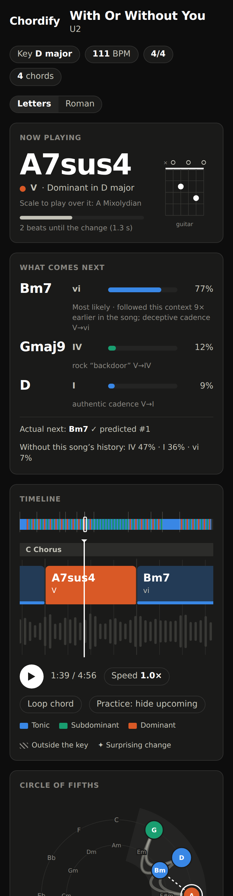
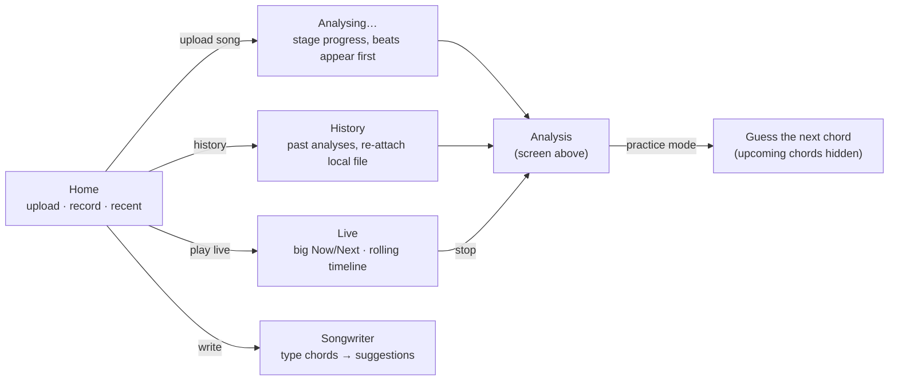
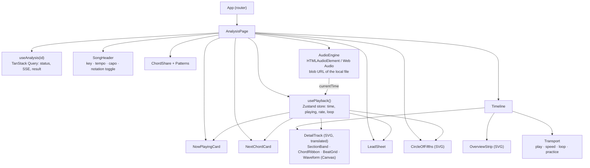
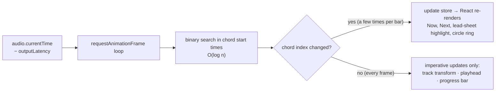

# 06 · Frontend and visualization

> How a song's chords are shown: every chord, how long it lasts, where it sits in the song and the key, and what is likely to come next. This covers the web app first; Android reuses the same components natively.

## 1. The analysis screen

The mockup below is a working HTML page ([`mockup/analysis-view.html`](mockup/analysis-view.html); download it and open it in a browser, press play, click the timeline, switch Letters/Roman). It renders a real `AnalysisResult` ([05 §5](05-api-and-communication.md#5-the-analysisresult-document)) generated from the McGill Billboard annotation of *With Or Without You* (U2). The chords, beats, bars, sections and key are the human annotation. The predictions come from the baseline progression model (4-gram trained on the other 889 Billboard annotations + this song's own history). The waveform is illustrative because the mockup has no audio.

<picture>
  <source media="(prefers-color-scheme: dark)" srcset="assets/mockup-desktop-dark.png">
  
</picture>

The moment shown is the V chord (A7sus4) at 1:39. A corpus-only model would guess IV (47 %) or I (36 %); with the song's history, ProgressionLM puts **vi (Bm7) at 77 %**, which is what comes next. The UI states both ("Without this song's history: IV 47 % · I 36 % · vi 7 %") so users see *why* the prediction changed.

## 2. Screens

| Screen | Purpose | Data source |
|---|---|---|
| Home | Upload a file, record, see recent analyses | `GET /analyses` |
| Analysing | Progress by stage; the beat grid appears as soon as the `partial:beats` event arrives | SSE |
| **Analysis** | Everything about one song (below) | `AnalysisResult` |
| **Live** | Play an instrument and see the chord and the predicted next chord in real time | WebSocket |
| Songwriter | Type a progression and get ranked suggestions with reasons | `POST /progressions/next` |
| Practice | Upcoming chords are hidden; the user guesses and is scored against the real chord and the model | `AnalysisResult.chords[].next` |

## 3. Components of the analysis screen

| Component | Shows | Encoding |
|---|---|---|
| **Now playing** | Current chord (large), Roman numeral + function in the key, scale to play over it, progress to the next change in **beats and seconds**, guitar diagram (piano toggle) | Text-first; function dot; progress bar |
| **What comes next** | Top-3 predictions with probability bars and a one-line reason; after the change: "Actual next: Bm7 ✓ predicted #1"; the corpus-only prior for comparison | Bars in the predicted chord's function colour; text in ink |
| **Overview strip** | The whole song as thin chord slices with section dividers and a viewport box | Width = time; click to seek |
| **Detail timeline** | ~20 s window moving under a fixed playhead: section band, chord ribbon (name + Roman numeral), beat grid with bar numbers, waveform | **Block width = chord duration**, which answers "how long did this chord last" at a glance; tinted fill + solid function-colour base line; current chord solid |
| **Surprise markers** | ✦ on chord changes the model gave < 15 % probability (borrowed chords, key changes, the bridge's first I→IV) | Symbol + tooltip with the probability |
| **Circle of fifths** | The song's chords on the circle (major outer, minor inner), node size = time share, the key's diatonic region shaded, arcs = transitions (width = count), dashed arc = predicted next move, ring = current chord | Position = harmonic distance; this is where "scales and stuff" become visible |
| **Time per chord** | Share of the song each chord occupies | Bars sorted by time |
| **Repeating progressions** | Detected loops in Roman numerals with names ("I–V–vi–IV, the Axis progression ×23") | Text list |
| **Lead sheet** | Bars in rows of four, grouped by section, current bar highlighted and auto-scrolled | Musician-standard chart; Letters/Roman toggle |

### 3.1 Colour: harmonic function, not chord identity

Colouring every chord differently would need 6–11 hues per song (median 6, p90 11 unique chords in Billboard), which is past what people can tell apart reliably, especially with colour-vision deficiency. Colour therefore encodes **harmonic function in the current key**, a small, stable set that also teaches theory:

| Function | Chords (major key) | Light | Dark |
|---|---|---|---|
| Tonic (home) | I, iii, vi | `#2a78d6` | `#3987e5` |
| Subdominant (moving away) | IV, ii | `#1baf7a` | `#199e70` |
| Dominant (tension) | V, vii° | `#eb6834` | `#d95926` |
| Outside the key (borrowed, secondary) | bVII, bVI, V/V… | grey + 45° hatch | grey + 45° hatch |
| No chord | N | neutral surface | neutral surface |

The three hues were run through a colour-vision validator: they pass all-pairs separation for deuteranopia/protanopia/tritanopia and normal vision in both themes. The chord name is always printed on the block, so colour is never the only channel (and aqua's lower contrast on the light surface is covered by those labels). "Outside the key" uses **texture**, not a fourth hue.

## 4. Component architecture (web)

| Concern | Choice |
|---|---|
| Language | Migrate to **TypeScript**; API types generated from OpenAPI (`openapi-typescript`) |
| Server state | TanStack Query (caching, retries, `ETag`), with a small SSE hook that updates the query cache |
| Playback/UI state | Zustand store (`time`, `playing`, `rate`, `loop`, `notation`, `transpose`) |
| Rendering | SVG for chord blocks, circle and stats (hundreds of elements); Canvas for the waveform (thousands of peaks); the whole detail track is one wide SVG moved with a CSS `transform`, not re-rendered |
| Waveform peaks | Decoded in a Web Worker from the local file (`AudioContext.decodeAudioData` → min/max per 10 ms); [wavesurfer.js](https://wavesurfer.xyz/) v7 is an acceptable shortcut |
| Chord preview sound | Tone.js sampler (click a chord to hear it) |
| Theming | CSS custom properties with light/dark sets (as in the mockup) |
| Tests | Vitest + Testing Library on the fixture JSON; Playwright e2e and screenshot tests (the mockup's screenshot script is the seed) |

### 4.1 Playback synchronisation

- One clock: the audio element's `currentTime`, corrected by `AudioContext.outputLatency` when available, so the highlight changes when the chord is *heard*.
- React state changes only when the chord or bar index changes (a few times per bar). The 60 fps motion is imperative DOM/SVG updates. The mockup uses exactly this approach.
- Speed control uses `playbackRate` with `preservesPitch = true`; loops use the segment's `start`/`end`.

## 5. Interactions

| Interaction | Behaviour |
|---|---|
| Click a chord / bar | Seek there; double-click loops that chord or bar (practice) |
| Keyboard | `Space` play/pause · `←/→` previous/next chord · `L` loop · `R` Roman/Letters · `+/−` transpose |
| Notation | Letters (A7sus4) · Roman (V) · Nashville numbers (5) |
| Transpose / capo | Shifts every label client-side (pitch-class arithmetic), shows the capo position for easier shapes |
| Simplify | Show triads only (Gmaj9 → G), for beginners |
| Hover a chord | Confidence, alternatives ("Em7 12 %"), duration in beats and seconds, surprise |
| Correct a chord | Context menu → pick a label → `POST /corrections`; the block shows "edited" |
| Practice mode | Upcoming chords hidden; the user picks the next chord before it plays; score against reality and against the model |
| Export | LAB, JAMS, ChordPro, MIDI from the server; print the lead sheet |

## 6. States

| State | What the user sees |
|---|---|
| Uploading | Progress bar from `XMLHttpRequest` upload events |
| Queued / running | Stage names ("Finding the beat…", "Listening for chords…", "Working out the key…"), progress from SSE |
| Partial | Beat grid and tempo appear first; chords fill in when decoding finishes |
| Low confidence | Hatched outline + "?" on segments with confidence < 0.5; alternatives on hover |
| No music / failed | Human message per `error.code` with retry |
| Offline history | Timeline without audio; "Attach file" re-links a local file whose SHA-256 matches |

## 7. Accessibility

- The Now card is an `aria-live="polite"` region, throttled to at most one announcement per chord change.
- Every chord is a focusable element with an accessible name ("A7sus4, five, dominant, 2.2 seconds").
- Colour is never alone: names are printed, "outside the key" is a texture, surprise is a symbol.
- `prefers-reduced-motion`: the timeline jumps chord by chord instead of scrolling smoothly, and the lead sheet does not auto-scroll.
- A table view of all segments (start, end, chord, Roman, confidence) is always available.

## 8. Live screen

A simplified analysis screen for playing along: a very large **Now** chord with a guitar/piano diagram, the **Next** prediction with an "in ~2 beats" countdown (from the online tempo), an input level meter, a rolling 15-second chord ribbon, and the running key. When the user stops, the session becomes a normal analysis they can save.

## 9. Android

The Android app implements the same components natively so the experience matches:

| Web component | Android implementation |
|---|---|
| AudioEngine + playback store | Media3 **ExoPlayer**; a `Choreographer` frame callback reads `currentPosition` |
| DetailTrack / OverviewStrip | Custom `ChordTimelineView` drawing on `Canvas` (same layout maths as the SVG) |
| Now / Next cards | Material cards bound to the ViewModel |
| Lead sheet | `RecyclerView` with a 4-column `GridLayoutManager` and section headers |
| Circle of fifths | Custom `View` (Canvas), shown in a bottom sheet on phones |
| History | Room `AnalysisEntity` storing the result JSON, so it works offline |
| Live | `AudioRecord` → OkHttp WebSocket → same message types as the web client |

The current `RecordFragment`, `ChromaFragment` and `HistoryFragment` stay until Phase 3, when the v2 screens replace the chroma image with the timeline.
