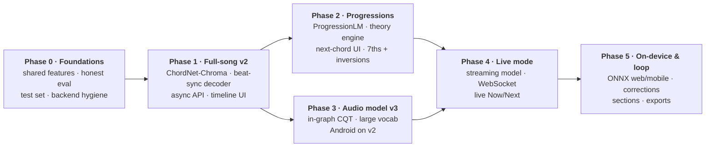
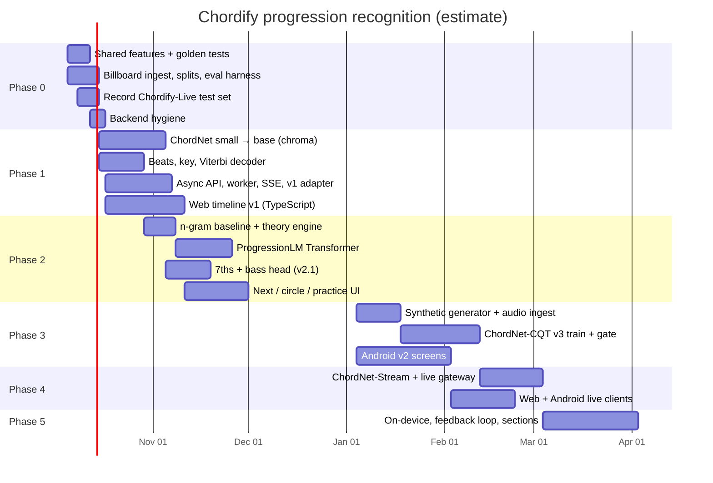

# 07 · Roadmap

> Phases, tasks, exit criteria, timeline and risks. Each phase ships something a user can see, and each model has to beat its predecessor on frozen test sets before it replaces it.

Durations are calendar estimates for a team of 2–3 people and should be re-planned after Phase 0, once real timings are known. Sizes: **S** ≤ 2 days · **M** ≤ 1 week · **L** ≤ 2 weeks.

## 1. Phase map

## 2. Phase 0 · Foundations (≈ 2 weeks)

**Goal:** trustworthy measurements and one feature pipeline, before any new model.

| Task | Owner | Size |
|---|---|---|
| Create `chordify_core` (package, CI, `features.nnls` at 44.1 kHz/2048, normalisation, `vocab` with pitch-class maths) | AI | M |
| Golden tests: frame rate/hop and value scale vs Billboard `bothchroma.csv`; transposition invariance property tests | AI | S |
| Ingest Billboard (Kaggle chroma + ChoCo JAMS), manifest, **artist-grouped frozen splits**, DVC remote | AI | M |
| Evaluation harness (`mir_eval` WCSR/seg, key, beats) and **Chordino baseline** on the test split | AI | M |
| Re-evaluate **v1** honestly: sliding window + majority smoothing on the test split and on Chordify-Live | AI | S |
| Record and label the **Chordify-Live** test set (~430 clips + progressions) | All | M |
| Backend hygiene: `pyproject.toml` with real pins, `fastapi.HTTPException`, env config (URLs, CORS), stop writing PNGs to disk | Backend | S |
| Clients read the API base URL from config (Vite env, Android BuildConfig) | Web, Android | S |

**Exit criteria:** v1 and Chordino numbers on the frozen test split are published in `docs/`; the backend installs from scratch; the golden feature test passes in CI.

## 3. Phase 1 · Full-song recognition v2 (≈ 5 weeks)

**Goal:** upload a song and get a correct, beat-aligned chord timeline in the browser.

| Task | Owner | Size |
|---|---|---|
| ChordNet `small` (BiGRU) on Billboard `majmin`+N with transposition augmentation, as a pipeline sanity check | AI | M |
| ChordNet `base` (Conformer) + all heads; add GuitarSet and first synthetic renders through NNLS | AI | L |
| Beat tracker integration + beat-synchronous Viterbi + key HMM; tune α and self-transition on validation | AI | M |
| ONNX export + model bundle + `registry.yaml`; ONNX Runtime in the worker (TensorFlow removed from serving) | AI, Backend | M |
| API v2: `POST/GET/DELETE /analyses`, `/events` (SSE), `/result`, `/models`; Pydantic schemas → OpenAPI | Backend | M |
| Celery worker pipeline with stage cache, retries, time limits; Postgres + Alembic; MinIO; `compose.yaml` | Backend | L |
| v1 adapter (`/predict`, `/predict_time_stamps`, `/extract_full_chroma`) on the new model | Backend | S |
| Web: TypeScript, TanStack Query, upload + progress, **Analysis page v1** (header, Now card, overview + detail timeline, lead sheet), playback sync | Web | L |

**Exit criteria (ship gates, [03 §7.2](03-models.md#72-baselines-and-ship-gates)):** majmin WCSR ≥ Chordino + 3 points on the Billboard test split · `seg` ≥ 0.80 · Chordify-Live single-chord accuracy ≥ 85 % · p95 analysis ≤ 20 s for a 4-min song on a 4-vCPU worker.

## 4. Phase 2 · Progression intelligence (≈ 4 weeks)

**Goal:** the app understands keys and progressions, predicts the next chord and explains itself.

| Task | Owner | Size |
|---|---|---|
| Key-relative 4-gram + song-cache baseline in `chordify_core.lm`; `POST /progressions/next` | AI, Backend | S |
| Theory engine: Roman numerals, functions, cadences, secondary dominants, borrowed chords, named patterns, scale hints, capo, simplify | AI | M |
| Ingest Chordonomicon + ChoCo symbolic partitions; key estimation for unkeyed data; event tokenisation | AI | M |
| Train **ProgressionLM**; distil the transition table *Q* into the decoder; surprise scores; predictions in `AnalysisResult` | AI | L |
| v2.1 acoustic model: `sevenths` vocabulary + bass head (inversions) | AI | M |
| Web: Next card, surprise markers, circle of fifths, time per chord, repeating progressions, Roman/Letters toggle, **practice mode**, **Songwriter** screen | Web | L |
| Corrections endpoint + UI (stored, not yet used for training) | Backend, Web | S |

**Exit criteria:** ProgressionLM top-1 ≥ 82 % and top-3 ≥ 94 % on Billboard test (baseline 80.1 % / 93.3 %), cold-start top-3 ≥ 80 %; the decoder with the LM prior does not lower WCSR; v2.1 reports `sevenths` WCSR.

## 5. Phase 3 · Audio-domain model v3 + Android on v2 (≈ 6 weeks)

**Goal:** a model that learns from audio directly, handles the phone/guitar domain and a large vocabulary, and can later stream.

| Task | Owner | Size |
|---|---|---|
| Synthetic chord & progression generator (FluidSynth, voicings, room/phone simulation) | AI | M |
| Ingest GuitarSet audio, AAM, Slakh2100 (chords from MIDI), POP909 renders | AI | M |
| In-graph CQT front-end; ChordNet `large` with the 170-class vocabulary; pre-train synthetic → fine-tune real | AI | L |
| Compare with v2 on GuitarSet test players + Chordify-Live progressions; **shadow run** on real jobs; promote if gates pass | AI, Backend | M |
| Android: v2 API via WorkManager + polling, native `ChordTimelineView`, Now/Next cards, lead sheet, Room history | Android | L |
| Start the v1 sunset timer once the Android v2 release is out | Backend | S |

**Exit criteria:** v3 ≥ v2 + 3 points `majmin` WCSR on the audio test sets, with `sevenths` reported; Android release using only v2 endpoints.

## 6. Phase 4 · Live mode (≈ 4 weeks)

| Task | Owner | Size |
|---|---|---|
| ChordNet-Stream (causal, chunked attention) distilled from v3 | AI | L |
| Live gateway: WebSocket protocol, sessions, incremental CQT, online HMM with hysteresis, online tempo, LM predictions | Backend, AI | M |
| Web live screen: AudioWorklet capture + resampling, big Now/Next, rolling ribbon | Web | M |
| Android live screen: AudioRecord → WebSocket | Android | M |

**Exit criteria:** p95 chord-change-to-UI latency ≤ 0.5 s; live `majmin` accuracy on Chordify-Live progressions within 5 points of offline v3.

## 7. Phase 5 · On-device, feedback loop and polish (ongoing)

- onnxruntime-web (WebGPU/WASM) and ONNX Runtime Mobile: live mode without a server, private by design.
- Corrections with consent feed an active-learning set; retrain on a schedule, gated as usual.
- Section detection (verse/chorus) from chord self-similarity; optional source separation on GPU; exports (MusicXML, PDF); accounts and sync.

## 8. Risks

| Risk | Likelihood | Impact | Mitigation |
|---|---|---|---|
| NNLS Vamp plugin is painful to install (native binary per OS) | High | Medium | Ship it inside the worker Docker image; v3 removes it from serving |
| Phone/solo-instrument domain shift stays large | Medium | High | GuitarSet + synthetic renders from Phase 1; Chordify-Live test set as the gate; monitoring of confidence and corrections |
| Dataset or pretrained-model licences block commercial use (e.g. madmom models are non-commercial; Chordonomicon terms) | Medium | High | Licence column in the manifest; model cards list training data; ship-candidate models trained only on commercially usable data if the app is sold (decision D3) |
| Beat tracking fails on rubato or beat-less music | Medium | Medium | Tracker confidence → fall back to frame-level decoding |
| Progression model biased toward Western pop | High | Low/Medium | Genre conditioning; suggestions framed as "likely", never "correct"; key override in the UI |
| GPU access limits training | Low | Medium | Models are small (≤ 11 M params); Colab/Kaggle GPUs suffice for v2 and the LM |
| Users upload copyrighted audio | High | Medium | 24 h retention, no redistribution, derived data only |
| Scope creep across phases | Medium | Medium | Exit criteria per phase; each phase ships on its own |

## 9. Definition of done (every phase)

- Code in `chordify_core` / `chordify_ai` / `chordify_backend` has tests, and CI is green.
- Models have a bundle, a model card and gate results committed to `docs/`.
- API changes appear in the OpenAPI document and in regenerated client types/fixtures.
- The mockup and screenshots are updated when the result schema changes.
