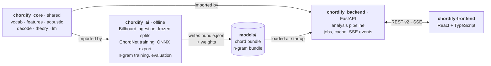

# 08 · Implementation status

What this PR builds from the plan, what was measured along the way, where the build
differs from the plan and why, and what is left. Everything below runs from a fresh
clone: see [§6](#6-running-it).

<picture>
  <source media="(prefers-color-scheme: dark)" srcset="assets/app-desktop-dark.png">
  
</picture>

*The built analysis screen (not the mockup), on a real recording: GuitarSet take
`00_Rock1-90-C#_comp` (CC BY 4.0), analysed by the v2 API with NNLS chroma,
`chordnet-chroma@2.0.0` and the n-gram progression model. The chords C#–F#–C#–G#–F#–C#
come out right, spelled Db–Gb–Db–Ab–Gb–Db in the key the app found (Db major), and the
next chord is predicted correctly. The tempo is not: 123 BPM for a 90 BPM take, a known
weakness of the beat tracker ([§4](#4-where-the-build-differs-from-the-plan)).*

## 1. Status by phase

| Phase | Built in this PR | Still open |
|---|---|---|
| **0 · Foundations** | `chordify_core` package. One feature definition shared by training and serving: NNLS at 44.1 kHz/2048, plus a plugin-free CQT chroma. Golden tests. Billboard ingestion. Frozen artist-grouped splits. `mir_eval` harness. Backend hygiene (settings, CORS allow-list, problem+json, no files on disk). Configurable API URL in the web app. CI. | Chordino baseline and honest v1 numbers on the test split. The Chordify-Live recordings. |
| **1 · Full-song v2** | ChordNet in PyTorch (Conformer and BiGRU, every head), training, ONNX export with a parity check, model bundles. Beat-synchronous Viterbi decoder. API v2 with jobs, SSE, cache and v1 adapter. TypeScript web app with upload, progress, timeline and playback sync. **`chordnet-chroma@2.0.0` trained on Billboard and served by default** ([§3.4](#34-acoustic-model)). | Beat This! (librosa's tempo can be off, e.g. 123 BPM on a 90 BPM take). Celery, Postgres and object storage ([§4](#4-where-the-build-differs-from-the-plan)). |
| **2 · Progressions** | Theory engine: Roman numerals, functions, cadences, secondary dominants, borrowed chords, named loops, scale hints. n-gram + song-cache model: `/progressions/next`, predictions, surprise and predictability in every result, and a change matrix in the decoder. Web: Now/Next, circle of fifths, time per chord, repeating progressions, lead sheet, Roman/Letters, Songwriter. Corrections endpoint. | The ProgressionLM Transformer (Chordonomicon). Local keys and modulations. `sevenths` in serving. Practice mode. Corrections UI. |
| **3–5** | Nothing yet beyond what they reuse: vocabulary tiers up to 169 classes, the `log_cqt` feature spec, the AudioWorklet recorder. | All. |

## 2. Code map



| Where | What |
|---|---|
| [`chordify_core/`](../../chordify_core) | Runtime library: `vocab`, `audio`, `features`, `acoustic`, `decode`, `theory`, `lm`, `synth` (test renders) |
| [`chordify_ai/`](../../chordify_ai) | Billboard ingestion and splits, ChordNet training, ONNX export, n-gram training, evaluation |
| [`chordify_backend/`](../../chordify_backend) | API v2 + v1 adapter; [README](../../chordify_backend/README.md) lists endpoints and settings |
| [`chordify-frontend/`](../../chordify-frontend) | Web app; [README](../../chordify-frontend/README.md) lists screens and the code map |
| [`data/splits/billboard_v1.json`](../../data/splits/billboard_v1.json) | Frozen split (train 712 / validation 89 / test 89) |
| [`models/progression-ngram/1.0.0/`](../../models/progression-ngram/1.0.0) | The shipped progression model (bundle + 23 KB of counts) |
| [`tests/`](../../tests) | 1,684 tests: `core`, `ai`, `backend` |
| [`tools/install_nnls_chroma.sh`](../../tools/install_nnls_chroma.sh) | Builds the NNLS Chroma / Chordino Vamp plugins from source (≈15 s) |
| [`.github/workflows/ci.yml`](../../.github/workflows/ci.yml) | CI: Python tests with the plugin built, web lint + typecheck + build |

## 3. What was measured

### 3.1 v1's train/serve skew is real, and there was a second offset

- Running the NNLS plugin on 22.05 kHz audio, as v1's backend does, gives 93 ms frames. v1 was trained on 46 ms frames. `features.nnls_bothchroma` now resamples to 44.1 kHz first and refuses any other frame step.
- The Vamp host stamps each frame at the **centre of its 16,384-sample block**, so frame 0 is at 0.186 s, not 0. Without this offset every chord boundary came out 0.186 s early, and beat-synchronous pooling then moved many changes a whole beat early. `FeatureSpec.offset` now carries it through targets, the decoder and evaluation. The plugin-free CQT chroma is centred at 0.

### 3.2 Data

- **890 Billboard songs** come from ChoCo (JAMS chords) plus the original `salami_chords.txt` (metre, tonic, sections, bars). No Kaggle login is needed for annotations.
- **One annotation is corrupt:** ChoCo's 0974 ("Kokomo") has overlapping intervals. The loader validates every track and drops it, and the training scripts skip it.
- **Split:** artist-grouped (primary artist ∪ repeated title + artist), 429 groups, seed 20261005. Models record the split file's SHA-256 in their bundle.

### 3.3 Progression model: the gate ProgressionLM has to beat

Key-relative 4-gram with a song cache (`progression-ngram@1.0.0`), trained on 711 train songs:

| Frozen split | Top-1 | Top-3 | Corpus only (no song cache), top-1 / top-3 | First chord change of a song, top-1 / top-3 |
|---|---|---|---|---|
| Validation (8,656 transitions) | 82.0 % | 93.3 % | 41.8 / 70.8 % | 54.9 / 83.2 % |
| **Test (8,272 transitions)** | **81.1 %** | **93.2 %** | 46.1 / 75.7 % | 58.6 / 78.3 % |

The phase 2 gate for ProgressionLM (top-1 ≥ 82 %, top-3 ≥ 94 %) stays, now measured against these numbers on the frozen test split rather than the random split used in [02](02-datasets.md#25-progressions-are-predictable-and-even-more-so-within-a-song).

### 3.4 Acoustic model

The ChordNet stack is implemented and tested end to end:

- targets with transposition augmentation;
- a multi-task loss;
- EMA and cosine LR;
- early stopping on `mir_eval` WCSR;
- ONNX export whose output matches PyTorch to within 1e-3 at any length;
- windowed inference in serving.

**Real data.** `tools/get_billboard_data.sh` downloads the annotations and McGill's own feature archive (`billboard-2.0-chordino`, no login). Its CSVs stamp each frame at the *start* of its block. On every song the file has exactly our extractor's frames minus the final two, and template chords agree with the annotations best at +0.09–0.14 s rather than at 0. So CSV frame *i* is our frame *i*, centred 0.186 s after its stamp, and the loader returns centre times.

[GuitarSet](https://zenodo.org/records/3371780) (Xi et al., 2018, CC BY 4.0) adds real recordings: 180 accompaniment takes on acoustic guitar, recorded with a microphone, with lead-sheet chords. Unlike Billboard's precomputed features, `chordify_ai.eval.guitarset` runs the whole serving path, including our own feature extraction from the audio.

majmin WCSR on real music:

| Model | Billboard validation (89 songs) | Billboard test (89) | GuitarSet, NNLS | GuitarSet, CQT |
|---|---|---|---|---|
| templates 0.1.0 (decoder untuned) | 61.1 % | 68.2 % | 65.1 % | 50.0 % |
| templates 0.2.0 (decoder tuned on validation), **served today** | 66.4 % | 71.4 % | 66.5 % | 56.0 % |
| **`chordnet-chroma@2.0.0`** (decoder tuned on validation), **served by default** | **81.4 %** | **80.5 %** | **76.1 %** | — |

ChordNet-Chroma 2.0.0 is a 3.6 M-parameter Conformer trained on the 711 Billboard training songs. It was trained on a MacBook with an M5 Pro through the Apple GPU, at 42 s per epoch; early stopping ended the run at epoch 17 and kept epoch 11 ([`chordify_ai/TRAINING.md`](../../chordify_ai/TRAINING.md)). The decoder was then tuned on validation and the test split scored once. On Billboard test, root accuracy is 83.7 %, sevenths 61.6 % (the `majmin` vocabulary maps G:7 to G) and segmentation 0.80, which is the phase 1 `seg` target. The server picks the model by itself where the NNLS plugin works (`CHORDIFY_CHORD_MODEL=auto`) and falls back to the templates elsewhere.

GuitarSet by style (majmin, NNLS):

| | singer-songwriter | rock | bossa nova | jazz | funk |
|---|---|---|---|---|---|
| templates 0.2.0 | 88.5 % | 85.0 % | 58.7 % | 45.8 % | 44.2 % |
| ChordNet 2.0.0 | 90.5 % | 86.3 % | 71.9 % | 66.2 % | 59.7 % |

On this real audio the model gains the most exactly where the templates struggled: quiet, jazzy comping. The recordings go through our own NNLS extraction, not McGill's CSVs, so this also confirms that serving produces the features the model was trained on.

One caveat seen while checking the demo song. On a chord with no third (A–D–E–G, an A7sus4), the templates and ChordNet disagree about major versus minor. The audio can't settle that, and `majmin` scoring leaves such chords out.

**Synthetic renders** of the validation annotations (25 songs, first 90 s, each render with its own timbre and tuning within ±30 cents), measured with the 0.1.0 template settings:

| Model | Features | majmin | sevenths | seg |
|---|---|---|---|---|
| `chroma-templates@0.1.0` | NNLS | 98.2 % | 67.3 % | 0.90 |
| `chroma-templates@0.1.0` | CQT (revision 2) | 97.0 % | 66.1 % | 0.87 |
| ChordNet Conformer (3.6 M parameters), trained on 150 other synthetic songs, best of 10 epochs, served from ONNX | CQT (revision 2) | 99.3 % | 67.7 % | 0.93 |

Synthetic renders check that the pipeline works end to end: features, timing, training, ONNX export, windowed inference and the decoder. They are **not** a quality gate. Both models are near the ceiling on clean synthetic chords, and neither has heard a real band, so the real test is Billboard. Both miss sevenths, because the `majmin` vocabulary maps G:7 to G.

This benchmark found one real bug. The CQT chroma kept a bin a third of a semitone sharp, and it estimated tuning modulo 33 cents, so recordings tuned more than 17 cents flat were read a semitone low. The template score on these renders went from 59.1 % to 97.0 % once that was fixed. Feature specs now carry a `revision`, and a bundle trained on an older revision is refused instead of silently mis-served.

### 3.5 Latency

Full analysis of a 296 s synthetic song on a 4-vCPU container, warm, two runs each. Every stage is included: decode, beats, features, model, both decoder passes, key, theory, predictions.

| Chord model | Features | Time |
|---|---|---|
| templates | NNLS | 5.4–5.8 s |
| templates | CQT | 3.2–3.4 s |
| ChordNet Conformer, synthetic-trained (ONNX Runtime) | CQT | 3.6–4.1 s |
| **`chordnet-chroma@2.0.0`** (ONNX Runtime), served by default | NNLS | 7.8 s |

The phase 1 budget is p95 ≤ 20 s for a 4-minute song. Switching features from CQT to NNLS costs about 2 s. ChordNet with half-beat decoding units costs 2–3 s more than the templates.

## 4. Where the build differs from the plan

| Plan | Built | Why | Revisit when |
|---|---|---|---|
| Celery + Redis workers, Postgres, object storage ([04 §1](04-software-architecture.md)) | `JobManager`: a thread pool inside the API process. Results and corrections are JSON files in `CHORDIFY_DATA_DIR`. The cache key is audio SHA-256 + model fingerprint + options. | One CPU VM handles the load (≈5 s per song), and it removes three services from setup. `JobManager` is the seam: `submit`, `get`, `result`, `events_after` and `cancel_or_delete` are what a Celery runner has to provide. | Analyses need more than one machine, or results must survive a disk loss |
| `models/registry.yaml` | One `bundle.json` per model (id, feature spec, vocabulary, file hashes, metrics, decoder parameters), selected by `CHORDIFY_CHORD_MODEL` / `CHORDIFY_LM_MODEL` | Same information without a second file to keep in sync | There are several deployments with different active models |
| DVC-tracked data, MLflow, Lightning | Frozen split JSON in git. ChoCo loaded directly with a local JSON cache. A plain PyTorch loop that writes `history.json`, `best.pt` and the bundle. | Nothing to host. The split and the n-gram bundle carry hashes. | More than one person trains models |
| Beat This! beat tracker | `librosa.beat.beat_track` (downbeat phase from chord-change alignment) | Already a dependency and fast. Beat This! adds a PyTorch model to serving. | Beat accuracy is measured on real audio |
| Key HMM with local keys | Global key from the decoded chords (duration-weighted Krumhansl–Kessler), then a second decoder pass with the key-relative LM | Enough for Roman numerals and predictions. ChordNet's key heads are trained, but serving does not read them yet. | Modulations matter in the UI (the key heads are ready) |
| ProgressionLM distilled into the decoder | The n-gram's key-relative change matrix, blended 50/50 with uniform | Same interface (`lm.change_matrix`), so the Transformer can drop in | ProgressionLM exists |
| TanStack Query + Zustand | Plain hooks. One `PlaybackClock` read through `useSyncExternalStore`, so only the components whose chord or bar changed re-render. | Two fewer dependencies for one page of server state | The app grows more pages with shared server state |

## 5. Next steps, in order

1. **Improve ChordNet.** 2.0.0 ships (Billboard test 80.5 %, GuitarSet 76.1 %). Next: train the `sevenths` vocabulary (`--vocabulary sevenths`) so G7 is no longer reported as G, and read the key heads for local keys. Every retrain follows [`chordify_ai/TRAINING.md`](../../chordify_ai/TRAINING.md) and must beat the shipped bundle on the test songs and on GuitarSet.
2. **Baselines for the gate.** Chordino (`nnls-chroma:chordino`, built by `tools/install_nnls_chroma.sh`) takes audio, and Billboard ships only features. So on Billboard the like-for-like baseline is the template model through the same decoder (`evaluate_model --model templates --chroma …`, [§3.4](#34-acoustic-model)); Chordino proper runs on GuitarSet and the Chordify-Live audio from step 3.
3. **Chordify-Live.** Record and label the phone/guitar test set ([02 §5](02-datasets.md)): the only in-domain measure for the Quick chord screen.
4. **ProgressionLM.** Ingest Chordonomicon + ChoCo symbolic, train the Transformer, and gate it against [§3.3](#33-progression-model-the-gate-progressionlm-has-to-beat).
5. **Sevenths and inversions in serving** (vocabulary and bass head already exist), local keys, sections.
6. Phase 3 onward as in [07](07-roadmap.md): audio-domain model v3, Android on v2, live mode.
7. **Remove v1.** Delete the v1 classifier files in `chordify_ai/` and the v1 endpoints once Android uses v2.

## 6. Running it

```bash
pip install -r chordify_backend/requirements.txt pytest httpx mir_eval
pip install torch onnx                     # only for ChordNet training/export and its tests
bash tools/install_nnls_chroma.sh          # optional NNLS features: needs libboost-dev and
                                           # pip install --no-build-isolation vamp
pytest -q                                  # 1,684 tests; NNLS tests skip without the plugin

uvicorn chordify_backend.app.main:app --port 8000
cd chordify-frontend && npm ci && npm run dev   # http://localhost:5173
```

Training and evaluation need the ChoCo checkout from the [README](README.md#reproducing-the-numbers-charts-and-mockup) (`--choco`).

| | |
|---|---|
|  |  |
| Songwriter: type chords, get the next one with the reason | The analysis screen at 390 px |
