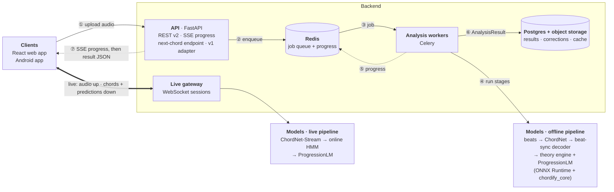
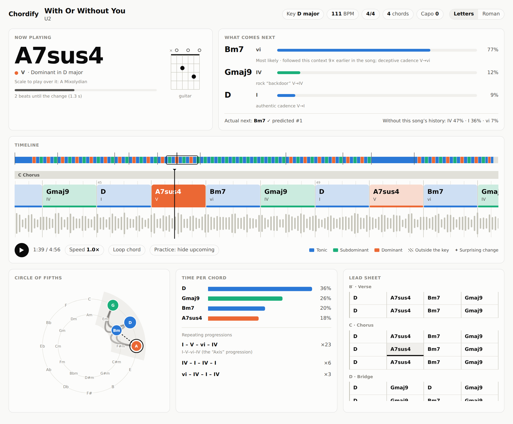

# Chord progression recognition: implementation plan

Today Chordify recognises **one chord per clip**. This plan takes it to:

1. **Full-song chord recognition.** Upload a song and get every chord with its start, end, duration in beats, Roman numeral and confidence, aligned to the beat grid, with the key and sections.
2. **Progression understanding and next-chord prediction.** Given the key and the chords so far, predict what comes next (with probabilities and a music-theory reason), both for uploaded songs and live while someone plays.
3. **A visualization** that shows each chord, how long it lasts, where it sits in the key and what is likely next.

It covers the datasets (including an assessment of the Billboard dataset v1 was trained on), the model architecture, the software architecture and the communication between the web/Android clients, the backend and the models.

> **Status:** phases 0–2 are largely built (core library, ChordNet training stack, v2 API, new web app). On real Billboard songs the served template model scores 66.4 % (validation) / 71.4 % (test); a first ChordNet run reached 75.6 % on validation after 4 epochs, and the full run is documented in [`chordify_ai/TRAINING.md`](../../chordify_ai/TRAINING.md). See [08 · Implementation status](08-implementation-status.md).

## Documents

| # | Document | Contents |
|---|---|---|
| 01 | [Current state audit](01-current-state.md) | How v1 works, and 19 findings with code references (leakage, train/serve skew, framing) |
| 02 | [Datasets](02-datasets.md) | Billboard, measured: what it is good and bad for; the dataset catalogue; data pipeline, splits, augmentation; the test set we record ourselves |
| 03 | [Model architecture](03-models.md) | ChordNet (acoustic), beat-synchronous decoder, ProgressionLM (next chord), theory engine, live model, evaluation gates, packaging |
| 04 | [Software architecture](04-software-architecture.md) | Services, repo layout, the analysis job pipeline, data model, deployment, MLOps, testing |
| 05 | [API and communication](05-api-and-communication.md) | REST v2, SSE progress, WebSocket live protocol, the `AnalysisResult` schema, v1 compatibility, errors |
| 06 | [Frontend and visualization](06-frontend-visualization.md) | Screens, components, colour encoding, playback sync, interactions, Android |
| 07 | [Roadmap](07-roadmap.md) | Phases 0–5 with tasks, exit criteria, timeline, risks |
| 08 | [Implementation status](08-implementation-status.md) | What is built, measured results, where the build differs from the plan, next steps |
| — | [`mockup/analysis-view.html`](mockup/analysis-view.html) | Clickable mockup of the analysis screen, driven by a real `AnalysisResult` |
| — | [`scripts/`](scripts/) | Reproduces every number, chart and screenshot in these documents |

## Key findings

- **v1's 96.5 % validation accuracy does not measure generalisation.** A noisy copy of every sample is added *before* the random split, and segments of the same song land in both train and test ([01 M2](01-current-state.md#31-model-and-data)).
- **The model is trained on a different signal than it is served.** Training features are at 46 ms/frame; the backend resamples to 22.05 kHz and feeds 93 ms frames, so the "4.6 s" window is really 9.3 s. Normalisation also differs ([01 S1–S2](01-current-state.md#32-trainserve-skew-the-model-does-not-see-at-inference-what-it-saw-in-training)).
- **Chords are shorter than the model's window.** Median chord length in Billboard is **1.61 s**; **95.5 %** of chords are shorter than the 4.64 s window. Full-song recognition needs a frame-level sequence model plus a decoder, not a bigger classifier ([02 §2.1](02-datasets.md#21-chords-are-short-so-the-model-must-work-frame-by-frame)).
- **Billboard stays, but it is not enough.** It is the right core for full-band pop and it has keys, metre and sections, but it has no audio, no solo-instrument recordings and too few progressions for a language model ([02 §1](02-datasets.md#1-verdict)).
- **Next chords are very predictable once the model sees the song's own history.** On held-out Billboard songs, a key-relative 4-gram gets 51 % top-1; adding the song's earlier chords gets **80 % top-1 / 93 % top-3**. That is why ProgressionLM is a Transformer over key-relative chords with the whole song as context ([02 §2.5](02-datasets.md#25-progressions-are-predictable-and-even-more-so-within-a-song)).

## Architecture at a glance



Numbered arrows are the upload flow: the client uploads (①), the API queues a job (②–③), workers run the models stage by stage while streaming progress (④–⑤), the result is stored (⑥), and the API relays progress over SSE and then serves the finished `AnalysisResult` (⑦). Live mode bypasses the queue: audio and chord events stream over one WebSocket. Full detail in [04](04-software-architecture.md) and [05](05-api-and-communication.md).

<picture>
  <source media="(prefers-color-scheme: dark)" srcset="assets/mockup-desktop-dark.png">
  
</picture>

*The analysis screen, rendered from a real Billboard annotation with predictions from the baseline progression model. See [06](06-frontend-visualization.md) and the [clickable mockup](mockup/analysis-view.html).*

## The plan in one table

| Phase | Ships | Model gate |
|---|---|---|
| **0 · Foundations** (≈2 wk) | One feature pipeline for training and serving, frozen splits, honest v1 + Chordino numbers, in-domain phone test set, installable backend | — |
| **1 · Full-song v2** (≈5 wk) | Upload a song → beat-aligned chord timeline (web); async jobs with progress | ≥ Chordino + 3 pts majmin WCSR; ≥ 85 % on phone clips |
| **2 · Progressions** (≈4 wk) | Keys, Roman numerals, next-chord predictions with reasons, circle of fifths, practice & songwriter modes, 7ths and inversions | LM ≥ 82 % / 94 % top-1/top-3 (baseline 80.1 / 93.3) |
| **3 · Audio model v3** (≈6 wk) | CQT model trained on audio, 170-chord vocabulary; Android on the v2 API | ≥ v2 + 3 pts on audio test sets |
| **4 · Live mode** (≈4 wk) | Play an instrument → chord + predicted next chord in real time | ≤ 0.5 s latency |
| **5 · On-device & loop** | Browser/phone inference, corrections → retraining, sections, exports | per release |

## Open decisions

These change the plan and need an answer from the team:

| # | Decision | Recommendation |
|---|---|---|
| D1 | Training framework: keep Keras or move to PyTorch? | **PyTorch** (reference implementations and pretrained parts are PyTorch). Keras 3 with the PyTorch backend is the compromise. Serving is ONNX either way |
| D2 | Where does the backend run, and is a GPU available? | A CPU VM is enough for v2 and the LM; a GPU only enables source separation and speeds up v3 training |
| D3 | Will the app be sold or monetised? | Decide before Phase 1: it determines which datasets and pretrained models (madmom models are non-commercial; Chordonomicon and RWC have their own terms) may be used in shipped models |
| D4 | User accounts? | Start with anonymous device ids; the schema already supports accounts |
| D5 | Keep uploaded audio? | No: 24 h retention, derived data only, local playback |
| D6 | Live mode on the server or on the device first? | Server first (Phase 4), on-device in Phase 5 with the same protocol |

## Reproducing the numbers, charts and mockup

```bash
# 1. Billboard annotations via ChoCo (no Kaggle login needed)
git clone --depth 1 --filter=blob:none --no-checkout https://github.com/smashub/choco.git /tmp/choco
git -C /tmp/choco sparse-checkout set --no-cone 'partitions/billboard/choco/*' 'partitions/billboard/raw/original/*'
git -C /tmp/choco checkout HEAD

# 2. Statistics → assets/billboard_stats.json, then charts → assets/fig-*.png
pip install numpy matplotlib
python scripts/billboard_stats.py --choco /tmp/choco
python scripts/make_figures.py

# 3. Mockup data (embedded into mockup/analysis-view.html) and screenshots
python scripts/make_mockup_data.py --choco /tmp/choco
NODE_PATH=$(npm root -g) node scripts/screenshot_mockup.js   # needs the playwright package
```

## Glossary

| Term | Meaning |
|---|---|
| **Chroma / NNLS chroma** | 12 numbers per frame, the energy of each pitch class (C, C#, … B). NNLS chroma (Mauch & Dixon) is a cleaner variant; "bothchroma" = bass chroma + treble chroma (24 numbers) |
| **CQT** | Constant-Q transform, a spectrogram with log-spaced (musical) frequency bins |
| **Harte syntax** | Standard chord label format: `A:min7`, `C:maj/3`, `N` (no chord) |
| **WCSR** | Weighted chord symbol recall: the fraction of song *time* labelled correctly, at a given vocabulary level (`majmin`, `sevenths`…) |
| **Roman numerals / key-relative** | Chords named by scale degree (I, IV, V, vi…) so that the same progression in any key looks the same |
| **Harmonic function** | Role of a chord in the key: tonic (home), subdominant (away), dominant (tension toward home) |
| **Frame posteriors** | The model's probability for every chord at every 46 ms frame |
| **Viterbi / HMM** | Algorithm that finds the most likely chord sequence given frame posteriors and transition probabilities |
| **Conformer** | Neural block combining self-attention (long-range context) and convolution (local patterns) |
| **Beat-synchronous** | Decisions made per beat instead of per frame, because chords change on beats |
